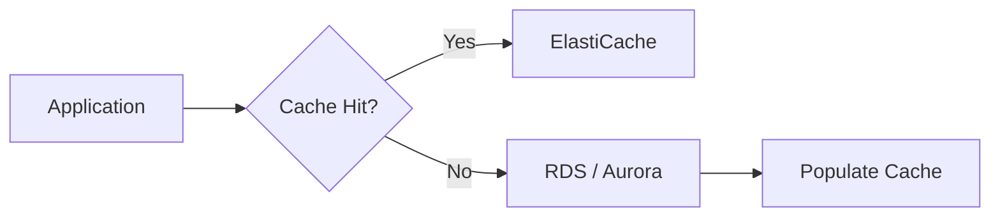
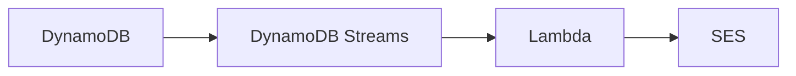

# 🔄 19-01. Database Review

> 기존에 배운 서비스는 핵심 차이와 시험 함정 위주로 복습한다.

## 🇰🇷 1. Amazon RDS
관리형 **관계형 데이터베이스** 서비스. SQL과 트랜잭션이 필요한 경우 적합하다.

- **Read Replica:** 읽기 부하 분산. 일반적으로 비동기 복제이며 복제 지연이 발생할 수 있다.
- **Multi-AZ:** 고가용성 및 Failover. 기존 Multi-AZ DB 인스턴스의 Standby는 읽기용이 아니다. Multi-AZ DB 클러스터는 읽기 가능한 Standby를 제공할 수 있다.
- **RDS Proxy:** DB 연결 풀링. Lambda 동시 실행으로 DB 연결이 급증할 때 유용하다.
- **RDS Custom:** 지원 엔진의 OS/DB에 대한 추가 제어.

## 🇰🇷 2. Amazon Aurora
AWS가 개발한 **MySQL/PostgreSQL 호환 관계형 DB 엔진**이자 RDS의 관리형 데이터베이스.

- 컴퓨팅 Writer/Reader와 분산 공유 스토리지 분리.
- **3개 AZ에 6개 스토리지 복사본**.
- Reader Endpoint는 읽기 **연결**을 분산한다. 개별 쿼리 단위 분산은 아니다.
- Aurora Serverless: 컴퓨팅 용량 자동 조절.
- Aurora Global Database: 기본적으로 Primary Region 쓰기, Secondary Region 읽기 및 DR.

```text
Writer ─┐
        ├── Shared Storage (6 copies / 3 AZ)
Readers ┘
```

## 🇰🇷 3. Amazon ElastiCache
반복 조회를 가속하는 **인메모리 캐시**. 자주 조회하는 데이터, 세션, 랭킹에 활용한다.



- 일반적으로 애플리케이션에서 캐시 조회·갱신·무효화 로직이 필요하다.
- **DAX**는 DynamoDB 전용 캐시이며 DAX 클라이언트/엔드포인트 연동이 필요하다.

## 🇰🇷 4. Amazon DynamoDB
서버리스 **Key-Value/Document NoSQL**. Key 기반 저지연 조회에 적합하다.

| 기능 | 핵심 |
|---|---|
| Provisioned / On-Demand | 용량 지정 / 요청량 기반 |
| DAX | DynamoDB 전용 캐시 |
| Streams | Item 변경 이벤트, 24시간 보관 |
| Global Tables | Multi-Region Active-Active, 비동기 복제 |
| TTL | 만료 Item 비동기 삭제 |
| PITR | 최대 35일 복구 기간 |
| Export to S3 | PITR 기반, RCU 미소비 |
| Import from S3 | 새 테이블 생성, 테이블 WCU 미소비 |

- 최대 Item 크기 **400KB**.
- Global Tables의 동시 업데이트 및 충돌을 고려한다.



## 🇰🇷 5. Amazon S3
일반적인 DBMS가 아닌 **객체 스토리지**. 이미지, 파일, 로그, 백업에 적합하다.

- Storage Classes / Lifecycle / Versioning / Replication.
- IAM, Bucket Policy, OAC, 암호화, Object Lock.
- S3 Event Notifications → Lambda 후처리 가능.
- S3 Select는 신규 고객에게 제공되지 않는다.

## 🎯 Exam Notes
| 요구사항 | 선택 |
|---|---|
| SQL 관계형 데이터 | RDS / Aurora |
| 읽기 확장 | Read Replica |
| 장애 조치 | Multi-AZ |
| Lambda DB 연결 폭증 | RDS Proxy |
| 일반 캐시 | ElastiCache |
| DynamoDB 캐시 | DAX |
| Item 변경 이벤트 | DynamoDB Streams |
| 글로벌 NoSQL 쓰기 | Global Tables |
| 객체 저장 | S3 |

## 🇯🇵 日本語 Summary
- **RDS:** リレーショナル DB。Read Replica は読み取り拡張、Multi-AZ は高可用性。
- **Aurora:** MySQL/PostgreSQL 互換。3 AZ に 6 コピーの共有ストレージ。
- **ElastiCache:** インメモリキャッシュ。アプリ側のキャッシュ制御が必要。
- **DynamoDB:** サーバーレス NoSQL。DAX、Streams、Global Tables、PITR。
- **S3:** オブジェクトストレージ。

## 🇺🇸 English Summary
RDS and Aurora serve relational workloads. Read Replicas scale reads; Multi-AZ improves availability. ElastiCache caches frequently accessed data. DynamoDB offers serverless NoSQL with Streams, DAX, and Global Tables. S3 stores objects, not relational records.

## 📚 Vocabulary
| English | 한국어 | 日本語 |
|---|---|---|
| Read Replica | 읽기 복제본 | リードレプリカ |
| Failover | 장애 조치 | フェイルオーバー |
| Cache Hit | 캐시 적중 | キャッシュヒット |
| Replication Lag | 복제 지연 | レプリケーションラグ |
