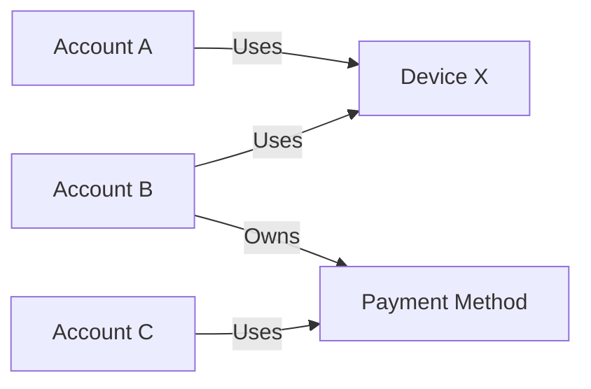
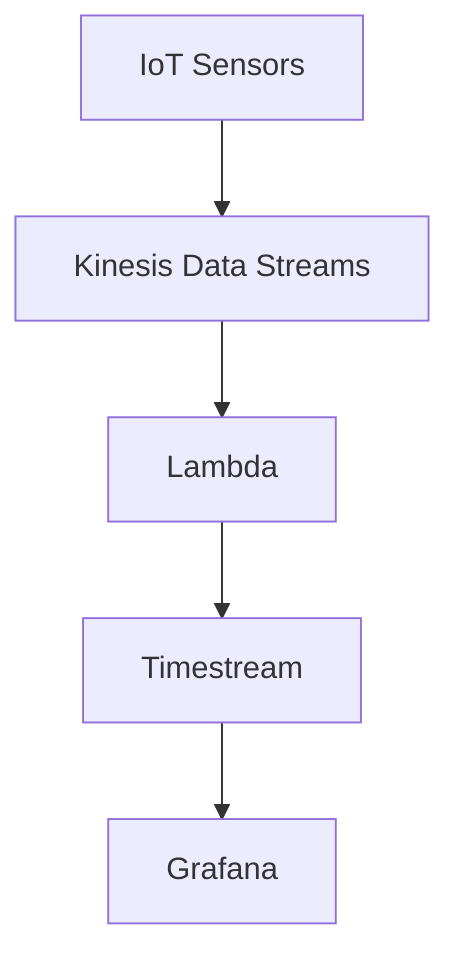

# 🆕 19-02. New Database Services

## 🇰🇷 1. Amazon DocumentDB
**MongoDB 호환 관리형 문서형 NoSQL DB.** JSON과 유사한 문서를 저장한다.

```json
{"userId":"U001","name":"Alex","preferences":{"theme":"dark"}}
```

- 3 AZ 스토리지 복제, 관리형 고가용성, 자동 스토리지 확장.
- MongoDB API 호환이지만 MongoDB 엔진 자체는 아니며 기능이 완전히 동일하지 않다.

**🎯 MongoDB-Compatible → DocumentDB**

## 🇰🇷 2. Amazon Neptune
**복잡한 연결 관계를 탐색하는 관리형 Graph DB.**

- Node/Vertex: 사용자, 계좌, 기기 같은 개체.
- Edge: 팔로우, 소유, 공유 등의 관계.
- 소셜 네트워크, 추천, 지식 그래프, 사기 탐지에 적합.



**Neptune Streams:** 그래프 변경 내역을 소비자가 읽어 외부 시스템에 반영할 수 있다. 동기화 로직은 별도로 구현해야 한다.

**🎯 Graph / Highly Connected Data → Neptune**

## 🇰🇷 3. Amazon Keyspaces
**Apache Cassandra 호환 서버리스 NoSQL DB.**

- Cassandra Query Language(**CQL**) 사용.
- 3 AZ 복제, 암호화, Provisioned / On-Demand 모드, 최대 35일 PITR.
- Cassandra 워크로드 이전 및 IoT/이벤트 데이터에 적합.

```sql
SELECT * FROM sensor_data WHERE device_id = 'sensor-A';
```

CQL은 SQL과 비슷하지만 Cassandra 데이터 모델과 쿼리 제약을 따른다.

**🎯 Apache Cassandra / CQL → Keyspaces**

## 🇰🇷 4. Amazon QLDB (Retired)
**Quantum Ledger Database:** 암호화 방식으로 변경 이력을 검증할 수 있었던 중앙화 원장 DB.

> ⚠️ **2025-07-31 지원 종료. 신규 설계에 사용하지 않는다.**

- Ledger: 거래 및 상태 변경을 기록하는 장부.
- Immutable Journal: 과거 변경 이력을 수정할 수 없는 저널.
- Cryptographic Verification: 해시 기반 무결성 검증.
- 중앙화된 관리 주체가 존재하며 탈중앙화 블록체인과 다르다.

**주의:** 현재 문서 상태의 수정/삭제가 불가능한 것이 아니라, 그 변경 이력이 저널에 보존된다는 뜻이다.

| QLDB (종료) | Managed Blockchain |
|---|---|
| 중앙화된 검증 가능 원장 | 블록체인 네트워크 관련 서비스 |
| 분산 합의 네트워크가 아님 | 네트워크에 따라 분산 합의 활용 |

**🎯 역사적 키워드: Immutable Centralized Ledger → QLDB**

## 🇰🇷 5. Amazon Timestream
**시간 정보가 포함된 데이터를 저장하고 분석하는 시계열 DB.**

| Time | Device | Temperature |
|---|---|---|
| 10:00 | Sensor A | 22°C |
| 10:01 | Sensor A | 24°C |
| 10:02 | Sensor A | 23°C |

- IoT 센서, CPU/메모리 사용률, 시간별 집계 및 추세 분석.
- SQL 기반 시계열 쿼리, Scheduled Queries, Multi-Measure Records.
- **Timestream for LiveAnalytics**의 Memory Store(최근 데이터), Magnetic Store(과거 데이터).

```text
Incoming Data
     ↓
Memory Store       (Recent)
     ↓
Magnetic Store     (Historical)
```

### Multi-Measure 개념 예시
```json
{"deviceId":"sensor-001","timestamp":"2026-10-10T10:00:00Z","temperature":25.5,"humidity":60}
```
위 JSON은 개념 설명용이며 실제 API 요청 형식과 다르다.

### IoT 분석 아키텍처


- **Kinesis:** 이벤트 수집·버퍼링·다중 소비자.
- **Lambda:** 데이터 변환·검증·필터링.
- **Timestream:** 시계열 저장·분석.
- **Grafana:** 시각화.

**Kinesis와 Lambda는 필수가 아니다.** IoT Core와 지원되는 Rules 작업 등을 활용해 더 단순한 구성이 가능하다.

> ⚠️ Timestream 제품별 기능과 신규 고객 이용 가능 여부를 최신 AWS 문서에서 확인해야 한다. Memory/Magnetic Store 설명은 Timestream for LiveAnalytics 기준.

**🎯 Time-Series / Timestamped Metrics → Timestream**

## 🎯 Exam Notes
| 키워드 | 서비스 |
|---|---|
| MongoDB | DocumentDB |
| Graph / Fraud Relationships | Neptune |
| Cassandra / CQL | Keyspaces |
| Immutable Ledger (historical) | QLDB (retired) |
| Time-Series | Timestream |
| Event Streaming | Kinesis Data Streams |
| Event Transformation | Lambda |

## 🇯🇵 日本語 Summary
- **DocumentDB:** MongoDB 互換のドキュメント DB。
- **Neptune:** 複雑な関係を探索するグラフ DB。
- **Keyspaces:** Cassandra / CQL 互換のサーバーレス DB。
- **QLDB:** 検証可能な中央集権型台帳 DB。2025 年 7 月にサポート終了。
- **Timestream:** 時系列データの保存と分析。Kinesis と Lambda は必須ではない。

## 🇺🇸 English Summary
DocumentDB supports MongoDB-compatible document workloads. Neptune handles graph relationships. Keyspaces supports Cassandra/CQL. QLDB was a centralized verifiable ledger database and is retired. Timestream handles timestamped metrics and time-series analytics.

## 📚 Vocabulary
| English | 한국어 | 日本語 |
|---|---|---|
| Document | 문서 | ドキュメント |
| Graph Traversal | 그래프 탐색 | グラフ探索 |
| Ledger | 원장 | 台帳 |
| Immutable | 불변 | 不変 |
| Time-Series | 시계열 | 時系列 |
| Data Ingestion | 데이터 수집 | データ取り込み |
