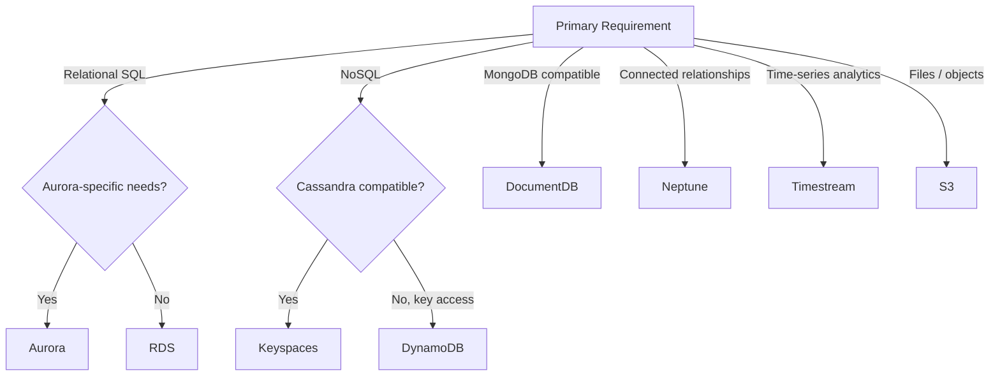
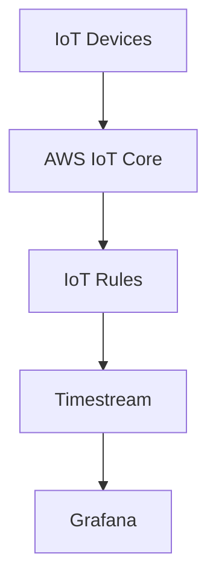
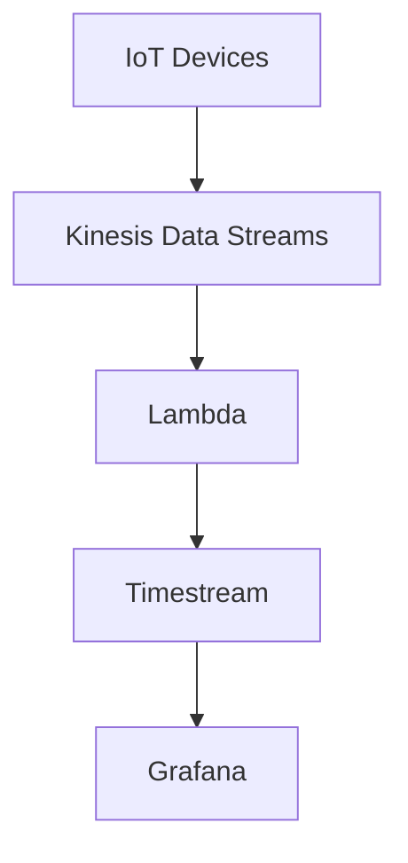
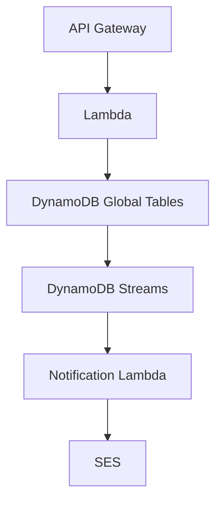
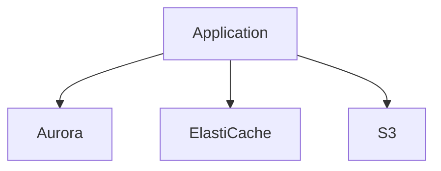

# 🧭 19-03. Database Selection Guide

> **그래서 어떤 상황에서 어떤 데이터베이스를 선택해야 하는가?**

## 🇰🇷 1. 선택 전 질문
1. **데이터 모델:** Relational / Key-Value / Document / Graph / Time-Series / Object?
2. **접근 패턴:** JOIN / Key Lookup / Relationship Traversal / Time Aggregation?
3. **트래픽:** 읽기·쓰기 비율, 처리량, 지연 요구사항?
4. **가용성:** Multi-AZ, Multi-Region, RPO/RTO?
5. **일관성:** Strong / Eventual Consistency?
6. **운영과 비용:** Serverless, 관리형, 저장/처리 비용?
7. **기존 기술:** MongoDB, Cassandra, MySQL/PostgreSQL 호환성?

## 🇰🇷 2. 요구사항별 선택표
| 요구사항 | 우선 검토 | 이유 |
|---|---|---|
| SQL 관계형 트랜잭션 | RDS | 관계형 모델과 관리형 운영 |
| MySQL/PostgreSQL + Aurora 기능 | Aurora | 공유 분산 스토리지 등 |
| 대규모 서버리스 NoSQL | DynamoDB | Key 기반 저지연 |
| MongoDB 호환성 | DocumentDB | 문서 모델 / 호환 API |
| 복잡한 관계 탐색 | Neptune | Graph Traversal |
| Cassandra / CQL 호환성 | Keyspaces | 기존 Cassandra 워크로드 |
| 시간별 센서 데이터 분석 | Timestream | Time-Series Analytics |
| 이미지 / 로그 / 백업 | S3 | Object Storage |
| 범용 캐싱 | ElastiCache | In-Memory Cache |
| DynamoDB 캐싱 | DAX | DynamoDB 전용 |
| 실시간 이벤트 스트리밍 | Kinesis Data Streams | 데이터 흐름, DB 아님 |
| 이벤트 변환 | Lambda | 컴퓨팅, DB 아님 |

> QLDB는 지원 종료되었으므로 신규 아키텍처 후보에서 제외한다.

## 🇰🇷 3. Database Decision Tree

1차 후보 선정용. 실제 선택에는 비용, 기능 지원, 일관성, 성능을 추가 검토한다.

## 🇰🇷 4. 헷갈리는 선택
### Read Replica vs Multi-AZ
- **Read Replica:** 읽기 확장.
- **Multi-AZ:** 고가용성 및 장애 조치.
- 전통적인 RDS Multi-AZ DB 인스턴스 Standby는 읽기 분산용이 아님.

### Aurora Global Database vs DynamoDB Global Tables
- **Aurora Global Database:** 기본적으로 Primary Region 쓰기, Secondary Region 읽기.
- **DynamoDB Global Tables:** 여러 Region에서 쓰기 가능한 Active-Active. 비동기 복제와 충돌 고려.

### ElastiCache vs DAX
- **ElastiCache:** 범용 캐시, 일반적으로 애플리케이션 캐시 로직 필요.
- **DAX:** DynamoDB 전용, DAX 클라이언트/엔드포인트 연동 필요.

### DynamoDB Streams vs Kinesis
- **DynamoDB Streams:** DynamoDB Item 변경 이력, 24시간 보관.
- **Kinesis Data Streams:** 범용 실시간 이벤트 수집, 버퍼링, 다중 소비자.

### Keyspaces vs Timestream
- **Keyspaces:** Cassandra/CQL 호환성이 중요.
- **Timestream:** 시간 기준 집계와 분석이 중요.
- **IoT라는 단어만으로 정답이 확정되지 않는다.**

## 🇰🇷 5. Architecture Examples
### A. 단순 IoT 시계열 분석

IoT Rules와 Timestream 제품의 지원 연동 방식은 실제 구축 전 확인한다.

### B. 스트리밍과 변환이 필요한 경우

- Kinesis가 필요한 이유: 버퍼링, 재처리, 여러 소비자.
- Lambda가 필요한 이유: 단위 변환, 데이터 검증, 스키마 정규화.
- 요구사항이 없다면 두 서비스를 추가할 필요 없음.

### C. 글로벌 서버리스 애플리케이션

글로벌 복제와 각 Region의 스트림 처리에서 중복 이벤트/알림에 유의한다.

### D. 관계형 주문 시스템

- Aurora: 주문·결제 데이터.
- ElastiCache: 반복 조회 캐시.
- S3: 상품 이미지.
- 캐시는 병목이나 명확한 요구사항이 있을 때 도입한다.

## 🎯 Exam Notes
| 키워드 | 서비스 |
|---|---|
| SQL / Relational | RDS, Aurora |
| Read Scaling | Read Replicas |
| High Availability | Multi-AZ |
| Connection Pooling | RDS Proxy |
| DynamoDB Microsecond Cache | DAX |
| Multi-Region Active-Active NoSQL | Global Tables |
| MongoDB | DocumentDB |
| Graph / Fraud Relationships | Neptune |
| Cassandra / CQL | Keyspaces |
| Time-Series | Timestream |
| Event Streaming | Kinesis |
| Data Transformation | Lambda |
| Object Storage | S3 |

## 📝 Review Questions
### Q1. Read Replica와 Multi-AZ의 주요 목적은?

정답

Read Replica는 읽기 확장, Multi-AZ는 장애 조치 및 가용성.

### Q2. MongoDB 호환 DB가 필요하다면?

정답

DocumentDB. 실제 API 호환 범위 확인 필요.

### Q3. 계좌·기기·결제수단 사이 복잡한 관계를 분석한다면?

정답

Neptune (Graph DB).

### Q4. 센서 → Timestream에 Kinesis와 Lambda가 반드시 필요한가?

정답

아니다. 스트리밍 버퍼링과 데이터 변환 등 요구사항이 있을 때 사용한다.

### Q5. Cassandra 호환성 vs 시간별 센서 분석?

정답

Cassandra/CQL → Keyspaces. 시간별 집계/분석 → Timestream.

## 🇯🇵 日本語 Summary
データモデル、クエリパターン、整合性、可用性、コストから DB を選択します。RDS/Aurora はリレーショナル、DynamoDB は NoSQL、DocumentDB は MongoDB 互換、Neptune はグラフ、Keyspaces は Cassandra、Timestream は時系列分析、S3 はオブジェクトストレージ。Kinesis と Lambda は必要な場合だけ追加します。

## 🇺🇸 English Summary
Select databases by data model, access pattern, consistency, availability, and cost. RDS/Aurora support relational workloads; DynamoDB handles key-based NoSQL; DocumentDB provides MongoDB compatibility; Neptune handles graphs; Keyspaces supports Cassandra/CQL; Timestream handles time-series analytics. Kinesis streams events and Lambda processes them. Avoid unnecessary components.

## 📚 Vocabulary
| English | 한국어 | 日本語 |
|---|---|---|
| Access Pattern | 접근 패턴 | アクセスパターン |
| Data Model | 데이터 모델 | データモデル |
| High Availability | 고가용성 | 高可用性 |
| Consistency | 일관성 | 一貫性 |
| Trade-off | 상충 관계 | トレードオフ |
