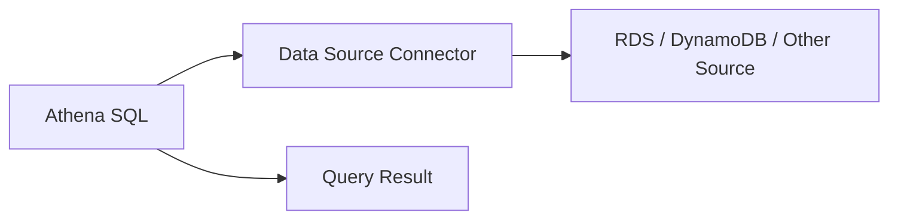

# 🔎 20-01. Amazon Athena

> Udemy: Athena 개요 + S3 Access Logs 실습  
> **Keyword: Serverless SQL on S3**

## 🇰🇷 1. Overview

Amazon Athena는 **Amazon S3에 저장된 데이터를 SQL로 직접 분석하는 서버리스 쿼리 서비스**이다.

- 데이터베이스 서버를 직접 배포할 필요가 없다.
- S3 파일을 RDS 또는 Redshift에 적재하지 않고 조회 가능하다.
- CSV, JSON, Parquet, ORC 등 여러 형식을 지원한다.
- 테이블의 스키마와 데이터 경로는 보통 **AWS Glue Data Catalog**에서 조회한다.
- 대표 사용 사례: S3 Server Access Logs, CloudTrail 로그, VPC Flow Logs, ALB 로그 분석.

```text
S3 Raw Files ──────┐
                   ▼
Glue Data Catalog → Athena SQL → Query Results (S3 or Athena Managed)
  (metadata)
```

**주의:** Data Catalog는 실제 CSV/Parquet 파일을 보관하지 않는다. 스키마와 데이터 위치 등 메타데이터를 보관한다.

## 🇰🇷 2. Database / External Table / Query Results

| 개념 | 역할 |
|---|---|
| `CREATE DATABASE` | Glue Data Catalog의 논리적 분류 공간 등록 |
| `CREATE EXTERNAL TABLE` | S3 경로(`LOCATION`)·컬럼·파일 형식을 Catalog에 등록 |
| `SELECT` | Athena가 S3의 실제 파일을 읽고 SQL을 실행 |
| Query Result Location | **조회 결과 파일**을 저장할 위치. **원본 S3 위치와 별개** |

예시: 단순화된 CSV 로그 파일을 대상으로 한 실행 가능한 예시. 실제 S3 Server Access Logs는 복잡한 로그 형식에 맞는 RegexSerDe와 공식 DDL을 사용해야 한다.

```sql
CREATE DATABASE IF NOT EXISTS s3_access_logs_db;

-- 예: s3://example-logs/simple/ 경로에 헤더 없는 CSV가 있다고 가정
CREATE EXTERNAL TABLE IF NOT EXISTS s3_access_logs_db.simple_logs (
    operation STRING,
    httpstatus INT
)
ROW FORMAT DELIMITED
FIELDS TERMINATED BY ','
STORED AS TEXTFILE
LOCATION 's3://example-logs/simple/';

SELECT *
FROM s3_access_logs_db.simple_logs
LIMIT 10;
```

**원본 로그 저장 버킷 ≠ Athena 쿼리 결과 버킷.**

Athena는 사용자 지정 S3 결과 버킷뿐 아니라 **Athena Managed Query Results**도 지원한다. 관리형 결과는 24시간 후 삭제된다.

## 🇰🇷 3. 실습 SQL: HTTP 상태 코드 분석

```sql
-- 로그의 오류 요청만 조회 (실제 Access Logs의 status 컬럼은 STRING일 수 있음)
SELECT *
FROM s3_access_logs_db.mybucket_logs
WHERE httpstatus = '403';

-- 요청 종류 및 상태 코드별 건수
SELECT operation, httpstatus, COUNT(*) AS request_count
FROM s3_access_logs_db.mybucket_logs
GROUP BY operation, httpstatus
ORDER BY request_count DESC;

-- 접근 거부 IP별 발생 횟수
SELECT remoteip, COUNT(*) AS denied_count
FROM s3_access_logs_db.mybucket_logs
WHERE httpstatus = '403'
GROUP BY remoteip
ORDER BY denied_count DESC;
```

`403`은 접근 거부를 의미하지만 반드시 침해 사고인 것은 아니다. IAM/S3 정책 오류 등 정상적인 원인도 조사한다.

S3 Server Access Logs는 Best-effort 전달이며 기록이 지연될 수 있다. 세밀한 API 감사에는 **AWS CloudTrail의 S3 Data Events**도 검토한다.

## 🇰🇷 4. 성능·비용 최적화

| 최적화 | 효과 |
|---|---|
| CSV → **Parquet / ORC** | 열 기반 저장으로 읽는 데이터량 감소 |
| GZIP / Snappy 등 압축 | 스캔 데이터 및 저장량 감소 가능 |
| `year=.../month=...` S3 Partition | 조건에 맞지 않는 폴더 스캔 방지 (Partition Pruning) |
| 작은 파일 통합 | 파일 메타데이터·열기 오버헤드 감소 |
| 필요한 열만 `SELECT` | 불필요한 데이터 읽기 감소 |

일반적인 Athena SQL 요금은 스캔 데이터량을 기준으로 하므로 쿼리 최적화가 비용에 직결된다. 단, 용량 기반 옵션 등 요금 모델에 따라 달라질 수 있다.

## 🇰🇷 5. Federated Query

Lambda 기반 **Data Source Connector** 등을 사용해 S3 이외의 데이터 소스(RDS, DynamoDB 등)를 SQL로 조회하는 기능. 일부 최신 커넥터는 구현 방식이 다를 수 있다.



## 🎯 Exam Notes

- **Ad-hoc SQL query over S3 → Athena**.
- **S3 데이터를 복사하지 않는 SQL 분석 → Athena**.
- **S3 로그의 날짜별 쿼리·비용 최적화 → Parquet + Partitioning**.
- **S3 CSV를 Parquet으로 변환 → Glue ETL**.
- **Data Catalog는 데이터 저장소가 아니라 Metadata Store**.
- **대규모 반복 분석·복잡한 Data Warehouse → Redshift**.

## 🇯🇵 日本語 Summary

Athena は Amazon S3 上のファイルを直接 SQL で分析するサーバーレスサービス。Glue Data Catalog は、テーブルのスキーマや S3 の場所などのメタデータを保持する。`CREATE EXTERNAL TABLE` により外部データの形式と場所を登録できる。Parquet・ORC、圧縮、パーティショニングによってスキャン量を削減する。

## 🇺🇸 English Summary

Athena is a serverless SQL query service for S3 data. Glue Data Catalog stores metadata, not actual records. External tables describe the S3 location, columns, and file format. Columnar formats, compression, and partition pruning reduce scanned data. Athena is ideal for ad-hoc analysis; Redshift targets recurring analytical warehousing.

## 📚 Vocabulary

| English | 한국어 | 日本語 |
|---|---|---|
| External Table | 외부 테이블 | 外部テーブル |
| Schema | 데이터 구조 | スキーマ |
| Query Result | 쿼리 결과 | クエリ結果 |
| Partition Pruning | 불필요한 파티션 제외 | パーティションプルーニング |
| Federated Query | 연합 쿼리 | フェデレーテッドクエリ |

## 📚 Official References

- [Athena managed query results](https://docs.aws.amazon.com/athena/latest/ug/managed-results.html)
- [Analyze S3 access logs with Athena](https://docs.aws.amazon.com/AmazonS3/latest/userguide/using-s3-access-logs-to-identify-requests.html)
