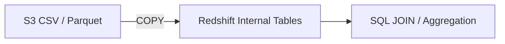
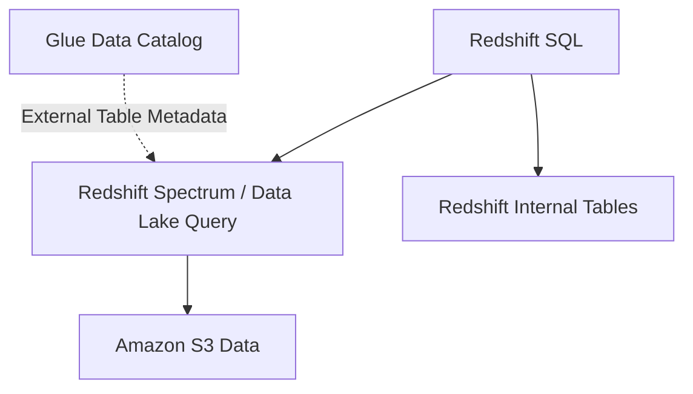

# 🏢 20-02. Amazon Redshift

> **Keyword: OLAP / Data Warehouse / COPY / Spectrum**

## 🇰🇷 1. OLTP vs OLAP

| OLTP | OLAP |
|---|---|
| 잦은 주문 생성·수정·조회 | 수십억 건의 판매 이력 분석 |
| 짧고 빠른 트랜잭션 | 복잡한 JOIN, 집계, 집단 분석 |
| RDS / Aurora 등 | **Amazon Redshift** |

Redshift는 PostgreSQL 기술을 바탕으로 하지만 PostgreSQL과 완전히 같은 DB가 아니다. **분석용 데이터 웨어하우스(OLAP)**로 설계됐다.

- 열 기반(**Columnar**) 저장: 분석에 필요한 열을 효율적으로 읽음.
- 대규모 병렬 처리(**MPP**): 여러 컴퓨팅 자원이 작업을 나눔.
- Sort Key / Distribution Key / Zone Map 등을 이용한 성능 최적화.
- 일반 PostgreSQL **보조 인덱스(Indexes)는 지원하지 않는다**. 강의의 '인덱스를 만들어 빠르다'는 설명은 부정확하다.

```text
            SQL Client / BI
                  ↓
              Leader Node
             /     |     \
            ↓      ↓      ↓
       Compute   Compute  Compute
          Node      Node     Node
```

## 🇰🇷 2. Provisioned vs Serverless

| Provisioned | Serverless |
|---|---|
| 인스턴스 타입/노드 수 등 용량 설정 | 컴퓨팅을 관리형으로 제공 |
| 장기 사용 시 할인 방식 고려 | 사용량 기반 컴퓨팅 및 별도 스토리지 비용 |
| Leader / Compute Node 아키텍처 학습 | 직접 노드 운영 부담 감소 |

## 🇰🇷 3. S3 데이터를 Redshift 내부로 적재: COPY



```sql
-- 예시. 버킷·테이블·Role은 실환경에 맞게 변경
COPY sales
FROM 's3://example-bucket/sales/'
IAM_ROLE 'arn:aws:iam::123456789012:role/RedshiftCopyRole'
FORMAT AS CSV;
```

- COPY는 **S3 원본을 조회만 하는 것이 아니라 Redshift 테이블에 적재**한다.
- Amazon Data Firehose의 Redshift 목적지는 내부적으로 S3를 거쳐 COPY를 사용한다.
- 소규모 단건 INSERT를 반복하기보다 대량 로드가 유리하다.
- EC2 애플리케이션 등에서 JDBC/ODBC로 연결할 수 있다.
- **Enhanced VPC Routing**으로 COPY/UNLOAD 데이터 이동 경로를 VPC 설정으로 통제할 수 있다. S3 객체를 퍼블릭으로 공개한다는 뜻이 아니다.

## 🇰🇷 4. Redshift Spectrum: S3 직접 조회



- S3의 **외부 테이블(External Table)**을 Redshift에 복사하지 않고 조회한다.
- Redshift 내부 테이블과 S3 외부 테이블의 JOIN이 가능하다.
- Redshift에서 **External Schema**를 만들고 Glue Data Catalog의 데이터베이스/테이블을 참조할 수 있다.
- 강의의 별도 Spectrum 노드 설명은 일부 프로비저닝 클러스터 방식에 해당한다. 최신 구성은 엔진/배포 방식에 따라 차이가 있다.

**COPY = 적재 / Spectrum = 원격 조회**를 구분할 것.

## 🇰🇷 5. Snapshot & Disaster Recovery

- 스냅샷은 특정 시점의 클러스터 백업이며 내부적으로 S3 기반 저장을 활용한다.
- 변경 데이터만 추가로 저장하는 증분 방식.
- 자동 스냅샷은 보존 기간 설정 가능, 수동 스냅샷은 삭제 전까지 보존할 수 있다(정책 및 과금 확인).
- **Cross-Region Snapshot Copy**로 다른 리전에서 복구 가능.
- 일부 프로비저닝 구성은 **Multi-AZ**도 지원한다. Multi-AZ는 AZ 장애 대비, Cross-Region Snapshot은 리전 재해 복구 목적.

## 🎯 Exam Notes

| Requirement | Candidate |
|---|---|
| OLAP / Data Warehouse / Complex JOIN | **Redshift** |
| S3 대량 데이터 적재 | **COPY** |
| S3 데이터를 Redshift로 복사하지 않고 조회 | **Redshift Spectrum** |
| BI 대시보드 | **QuickSight** |
| 다른 리전 백업 | **Cross-Region Snapshot Copy** |
| 클러스터 VPC 데이터 이동 경로 통제 | **Enhanced VPC Routing** |

## 🇯🇵 日本語 Summary

Redshift は OLAP 向けのデータウェアハウス。列指向ストレージと MPP で大規模集計を処理する。`COPY` は S3 データを Redshift 内に取り込み、Redshift Spectrum は S3 外部テーブルを取り込まずに参照する。スナップショットのリージョン間コピーは災害対策に役立つ。

## 🇺🇸 English Summary

Redshift is an OLAP data warehouse optimized for analytical joins and aggregations. COPY loads S3 data into Redshift tables; Redshift Spectrum queries S3 external data without loading it. Snapshots and cross-Region copies support disaster recovery. Redshift does not support conventional PostgreSQL indexes.

## 📚 Vocabulary

| English | 한국어 | 日本語 |
|---|---|---|
| Data Warehouse | 데이터 웨어하우스 | データウェアハウス |
| OLAP | 온라인 분석 처리 | オンライン分析処理 |
| COPY | 대량 데이터 적재 | 一括ロード |
| Spectrum | S3 외부 데이터 분석 | 外部データ分析 |
| Columnar Storage | 열 기반 저장 | 列指向ストレージ |

## 📚 Official References

- [Redshift Spectrum external tables](https://docs.aws.amazon.com/redshift/latest/dg/c-spectrum-external-tables.html)
- [Unsupported PostgreSQL features](https://docs.aws.amazon.com/redshift/latest/dg/c_unsupported-postgresql-features.html)
