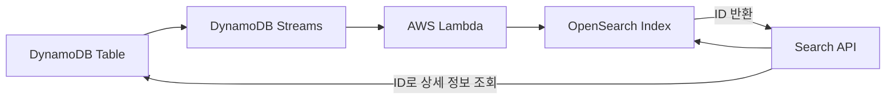

# 🔍 20-03. Amazon OpenSearch Service

> **Keyword: Full-text Search / Inverted Index / Log Analytics**

## 🇰🇷 1. Overview

Amazon OpenSearch Service는 전문 검색, 검색 결과 관련도 평가, 로그 검색 및 분석을 위한 관리형 검색·분석 서비스이다. 과거 Amazon Elasticsearch Service와 연결되는 서비스다.

**DynamoDB와의 차이:**

| DynamoDB | OpenSearch |
|---|---|
| Primary Key / GSI / LSI 중심 효율적 조회 | 다양한 필드의 Full-text / Fuzzy Search |
| 원본 데이터 CRUD 담당 | 검색용 인덱스·로그 탐색 담당 |
| 임의 필드를 찾기 위한 Scan은 비효율적일 수 있음 | 검색어를 빠르게 찾는 역색인(Inverted Index) 활용 |

역색인은 **단어 → 그 단어가 포함된 문서 목록**을 미리 구성한 검색용 목차다. 부분 검색 및 언어 분석은 인덱스의 Analyzer 설정 등에 따라 달라진다.

## 🇰🇷 2. DynamoDB + OpenSearch Pattern



1. 사용자가 DynamoDB의 상품 Item을 추가/수정/삭제한다.
2. DynamoDB Streams에 변경 이벤트가 기록된다.
3. Lambda가 이벤트를 읽어 OpenSearch 인덱스를 반영한다.
4. 검색은 OpenSearch에서 수행하고, 최신 상세 정보는 DynamoDB에서 조회할 수 있다.

- Lambda는 INSERT/UPDATE/DELETE를 모두 처리해야 검색 인덱스가 일치한다.
- 비동기 동기화이므로 검색 결과가 원본보다 잠시 뒤처질 수 있다.
- 최신 환경은 **OpenSearch Ingestion과 DynamoDB Zero-ETL 통합**도 검토 가능.

## 🇰🇷 3. Log Ingestion Patterns

```text
CloudWatch Logs ── Subscription Filter ── Lambda ── OpenSearch

Kinesis Data Streams ── Amazon Data Firehose ── OpenSearch

Kinesis Data Streams ── Lambda (custom consumer) ── OpenSearch
```

- **Subscription Filter:** CloudWatch Logs의 로그 이벤트를 대상으로 전달.
- **Amazon Data Firehose:** 버퍼링 및 관리형 전달, 일반적으로 Near Real-Time.
- **Lambda:** 이벤트 단위 사용자 지정 가공과 인덱싱.
- **OpenSearch Dashboards:** 로그 검색 결과를 차트와 대시보드로 시각화.

> 옛 슬라이드의 `CloudWatch Logs → Subscription Filter → Firehose → OpenSearch` 직접 전송은 실제 로그 배치 형식 때문에 제약이 있다. 공식 지원 아키텍처를 검토한다.

## 🇰🇷 4. Deployment, Query, Security

- **Provisioned Domain:** 인스턴스·스토리지 등 클러스터 용량과 구성을 선택.
- **OpenSearch Serverless:** Collection 단위로 컴퓨팅 용량 관리 부담을 줄임. 사용 패턴에 따라 비용이 달라진다.
- Query DSL은 주로 JSON 기반이며 SQL/PPL 지원 방식도 있다.
- IAM, 암호화(KMS at rest/TLS in transit), 네트워크·액세스 정책 등으로 보호.
- Cognito 등과 Dashboards 인증을 연계할 수 있는 구성도 있다.

## 🎯 Exam Notes

| Keyword | Candidate |
|---|---|
| Product Search / Full-text | **OpenSearch** |
| Search over DynamoDB items | **DynamoDB Streams → Lambda → OpenSearch** |
| Searchable CloudWatch logs | **CloudWatch Logs → Lambda → OpenSearch** |
| Log visualization | **OpenSearch Dashboards** |
| SQL analysis of S3 files | Athena (not OpenSearch first) |

## 🇯🇵 日本語 Summary

OpenSearch は全文検索、あいまい検索、ログ分析に適したサービス。DynamoDB を元データとして保持し、Streams と Lambda で検索インデックスを同期できる。ログの可視化には OpenSearch Dashboards を利用する。

## 🇺🇸 English Summary

OpenSearch provides full-text search and log analytics. DynamoDB can remain the source of truth while Streams and Lambda update the OpenSearch index. OpenSearch Dashboards visualizes search and operational log data. Managed domains and serverless collections are available.

## 📚 Vocabulary

| English | 한국어 | 日本語 |
|---|---|---|
| Full-text Search | 전문 검색 | 全文検索 |
| Inverted Index | 역색인 | 転置インデックス |
| Source of Truth | 원본 기준 저장소 | 正本データソース |
| Subscription Filter | 구독 필터 | サブスクリプションフィルター |
