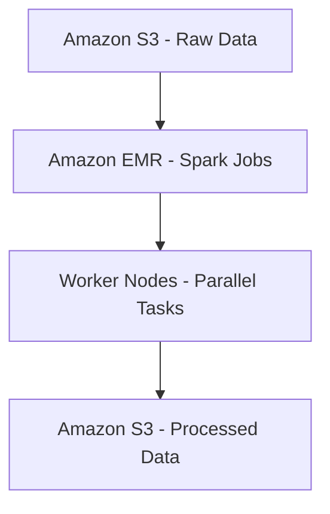

# 🧩 20-04. Amazon EMR

> **Keyword: Hadoop / Spark / Big Data / Primary–Core–Task / Spot**

## 🇰🇷 1. Overview

Amazon EMR(Elastic MapReduce)은 **Apache Hadoop, Spark, Hive 등 빅데이터 프레임워크를 관리형으로 실행**하게 해주는 서비스다.

- 방대한 로그/이벤트/파일을 여러 컴퓨팅 노드로 나누어 처리.
- 대표 사용 사례: Big Data ETL, Spark Analytics, 분산 데이터 처리, 머신 러닝 전처리.
- EMR은 Spark 자체나 데이터베이스 자체가 아니라 **프레임워크 실행·관리 플랫폼**이다.
- MapReduce 기본 사고방식: 대량 데이터를 나누어 처리(Map)하고 중간 결과를 결합(Reduce).



## 🇰🇷 2. EMR on EC2 Nodes

| Node Type | 역할 | 일반적인 운영 전략 |
|---|---|---|
| **Primary** (구 Master) | 클러스터 관리·작업 조정 | 안정적인 용량 확보 |
| **Core** | 분산 작업 처리 + HDFS 데이터 저장 | 중요 데이터 보유 시 안정적 인스턴스 |
| **Task** | 분산 작업 처리만 담당, HDFS 저장 안 함 | 중단 가능 작업에 Spot 활용 |

```text
              Primary Node
              /         \
             ↓           ↓
        Core Nodes    Task Nodes
     (HDFS + Tasks)  (Tasks Only)
```

- 일부 HA 구성은 여러 Primary Node를 사용할 수 있다.
- Task Node가 Spot 중단을 당하면 실행 작업은 재시도해야 할 수 있지만 HDFS 데이터 손실 위험이 Core보다 작다.
- **On-Demand = 절대 중단되지 않는다**는 뜻이 아니다.
- **Reserved Instance**는 일정 기간 계속 실행할 의무가 아니라 약정 조건에 따른 EC2 할인 방식이다.

## 🇰🇷 3. Long-running vs Transient

- **Long-running Cluster:** 장기간 실행하며 여러 작업을 처리.
- **Transient Cluster:** 특정 작업만 실행한 뒤 종료.
- S3에 원본/결과를 보관하면 클러스터 종료 후에도 S3 객체가 남는다.
- 반면 클러스터 내부 HDFS에만 저장한 데이터는 종료 시 사라질 수 있다.

## 🇰🇷 4. Deployment Options

| Option | 관리 범위 |
|---|---|
| EMR on EC2 | EC2 클러스터의 노드 및 실행환경 구성 |
| EMR on EKS | Kubernetes 환경에서 EMR 작업 실행 |
| EMR Serverless | Spark/Hive 작업을 위한 클러스터 프로비저닝 부담 최소화 |

**주의:** 'EMR은 반드시 EC2 인스턴스를 직접 선택한다'는 설명은 **EMR on EC2**에 해당한다.

## 🎯 Exam Notes

- **Hadoop / Spark big-data processing → EMR**.
- **Primary = 관리, Core = 저장+처리, Task = 처리만**.
- **중단 허용 가능한 추가 작업 용량 → Spot Task Node**.
- **주기적인 배치 분석 후 클러스터 종료 → Transient EMR Cluster**.
- **직접 클러스터를 관리하지 않고 Spark → EMR Serverless 또는 Glue ETL**(요구사항에 따라 선택).

## 🇯🇵 日本語 Summary

Amazon EMR は Hadoop や Spark を AWS 上で実行するマネージドビッグデータ処理サービス。Primary Node は管理、Core Node はデータ保存と計算、Task Node は計算のみを担当する。中断可能な Task Node には Spot を活用できる。

## 🇺🇸 English Summary

Amazon EMR runs distributed big-data frameworks such as Spark and Hadoop. Primary nodes coordinate the cluster, core nodes compute and store HDFS data, and task nodes compute without storing HDFS data. Spot task nodes can reduce cost when interruptions are tolerable.

## 📚 Vocabulary

| English | 한국어 | 日本語 |
|---|---|---|
| Distributed Processing | 분산 처리 | 分散処理 |
| Primary Node | 주 관리 노드 | プライマリノード |
| Core Node | 저장·계산 노드 | コアノード |
| Task Node | 계산 전용 노드 | タスクノード |
| Transient Cluster | 임시 클러스터 | 一時クラスター |
