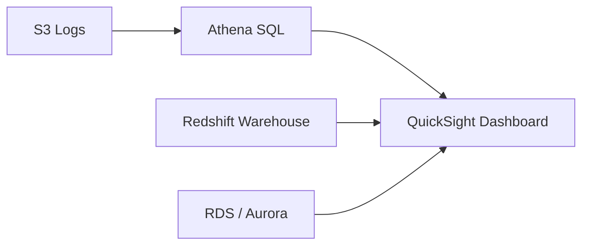

# 📈 20-05. Amazon QuickSight (Amazon Quick Sight)

> **Keyword: BI / Dashboard / SPICE / Direct Query / CLS**

## 🇰🇷 1. Overview

Amazon QuickSight는 **관리형·서버리스 BI(Business Intelligence) 시각화 서비스**이다. 다양한 데이터 소스를 연결하여 차트, 보고서, 대화형 대시보드를 만든다.

- 대표 데이터 소스: Athena, Redshift, RDS/Aurora, S3, 지원되는 SaaS/외부 데이터 소스.
- 임베디드 분석(웹사이트·애플리케이션 안에 대시보드 삽입) 지원.
- **Athena/Redshift = 데이터 조회·분석 / QuickSight = 데이터 시각화·공유**.
- 모든 사용자가 '세션당' 과금하는 것은 아니다. 사용자 구독·용량 과금 등 현재 요금제를 확인해야 한다.



## 🇰🇷 2. SPICE vs Direct Query

**SPICE(Super-fast, Parallel, In-memory Calculation Engine)**는 데이터를 QuickSight 쪽으로 가져와 In-memory 방식으로 빠르게 계산하는 엔진이다.

| 구분 | SPICE | Direct Query |
|---|---|---|
| 데이터 조회 | 가져온 데이터셋을 분석 | 원본 데이터 소스에 쿼리 |
| 장점 | 대시보드 응답이 빠르고 원본 부하 감소 | 원본의 최신 데이터 조회 |
| 주의 | 데이터 새로고침 필요 | 원본 DB 성능·쿼리 비용 영향 |

```text
SPICE:        Redshift ── Import/Refresh ──> SPICE ──> Dashboard
Direct Query: Redshift <──── Query ──────── QuickSight Dashboard
```

CSV 파일만 SPICE를 사용하는 것이 아니다. Athena/RDS/Redshift 등 지원 데이터 소스에서도 데이터셋을 SPICE로 가져올 수 있다.

## 🇰🇷 3. Dataset → Analysis → Dashboard

| 개념 | 역할 |
|---|---|
| **Dataset** | 데이터 소스 연결·가공, 분석에 사용할 컬럼 지정 |
| **Analysis** | 차트, 필터, 정렬, 계산 등을 편집하는 작업 공간 |
| **Dashboard** | Analysis를 **Publish**해서 사용자에게 공유하는 읽기 전용 결과 화면 |

**Dashboard의 '읽기 전용 Snapshot'은 구성/편집 관점**의 설명이다. 데이터는 SPICE Refresh나 Direct Query 결과에 따라 갱신될 수 있다. Reader는 허용된 필터를 조작할 수 있지만 Analysis 자체를 편집하지 않는다.

## 🇰🇷 4. Users, Groups, Security

- 대시보드 공유에는 QuickSight의 콘텐츠 접근 권한 설정이 필요하다.
- IAM 권한은 AWS 서비스 관리와 연계되며, QuickSight 내 Reader/Author/Admin 권한과 구분한다.
- 사용자·그룹은 내부 관리 또는 IAM Identity Center 연동 방식 등을 활용할 수 있다.
- **CLS(Column-Level Security):** 민감한 컬럼 접근 제한 (예: 급여 열).
- **RLS(Row-Level Security):** 조건에 맞는 행만 접근 (예: 서울 직원에게 서울 주문만).

## 🇰🇷 5. Current Naming (2026)

기존 **Amazon QuickSight**는 AWS의 브랜드 개편을 거쳤다. 현재 공식 안내에서 **Amazon Quick**의 BI 기능은 **Amazon Quick Sight**라고 표기하며, 기존 QuickSight API/SDK/통합은 유지된다. SAA 강의와 문제에는 여전히 QuickSight라는 이름이 나타날 수 있다.

## 🎯 Exam Notes

| Keyword | Candidate |
|---|---|
| Business Intelligence / Dashboard | **QuickSight / Quick Sight** |
| Fast in-memory calculation | **SPICE** |
| Current data directly from source | **Direct Query** |
| Chart creation and filters | **Analysis** |
| Publish & Share | **Dashboard** |
| Hide salary column | **CLS** |
| Restrict rows by region | **RLS** |
| S3 SQL + Dashboard | **Athena + QuickSight** |

## 🇯🇵 日本語 Summary

QuickSight（現在の Quick Sight）は BI ダッシュボードを作成するサービス。SPICE はデータを取り込み、高速なインメモリ集計を行う。Direct Query は元データソースに問い合わせる。Analysis で編集し、Dashboard に公開して共有する。CLS は列、RLS は行へのアクセスを制御する。

## 🇺🇸 English Summary

QuickSight, now called Quick Sight within Amazon Quick, provides BI dashboards and embedded analytics. SPICE imports data for fast in-memory analytics, while Direct Query accesses the source. Analyses are editable; dashboards are published and shared. CLS restricts columns, and RLS restricts rows.

## 📚 Vocabulary

| English | 한국어 | 日本語 |
|---|---|---|
| Business Intelligence | 비즈니스 인텔리전스 | ビジネスインテリジェンス |
| Dataset | 데이터셋 | データセット |
| Analysis | 분석 편집본 | 分析 |
| Dashboard | 대시보드 | ダッシュボード |
| Column-Level Security | 열 수준 보안 | 列レベルセキュリティ |

## 📚 Official References

- [What is Amazon Quick?](https://docs.aws.amazon.com/quick/latest/userguide/what-is.html)
