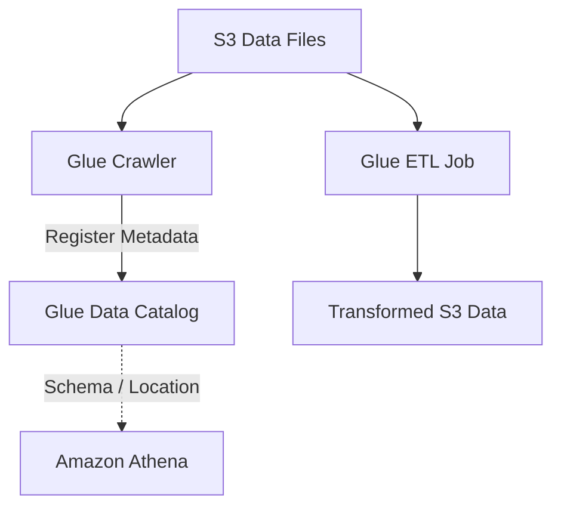

# 🛠️ 20-06. AWS Glue

> **Keyword: ETL / Crawler / Data Catalog / Job Bookmarks / Parquet**

## 🇰🇷 1. Glue ETL: Extract → Transform → Load

AWS Glue는 데이터 분석을 위한 **서버리스 데이터 통합·ETL 서비스**이다.

- **Extract:** S3, RDS 등에서 원본 데이터 읽기.
- **Transform:** 필터링, 컬럼 추가/변경, 결측 데이터 처리, 포맷 변환.
- **Load:** 변환된 데이터를 S3, Redshift 등 목적지에 기록.


- CSV → Parquet 전환은 Columnar Format의 장점을 활용해 Athena의 스캔량을 줄일 수 있다.
- S3 Object Created Event → EventBridge 또는 Lambda → Glue Job 시작 방식으로 자동화 가능.
- ETL은 **실제 데이터를 가공하고 새로운 결과를 저장**한다. 메타데이터 저장만 하는 것은 아니다.

## 🇰🇷 2. Glue Crawler vs Data Catalog vs ETL

| 구성 요소 | 정확한 역할 | 실제 파일 내용 변경? |
|---|---|---|
| **Crawler** | 데이터 원본을 조사하고 스키마 추론 | X |
| **Data Catalog** | Database/Table 스키마, S3 위치 등의 메타데이터 보관 | X |
| **ETL Job** | 데이터를 실제로 읽어 변환하고 저장 | O |



### Athena 실습과의 연결

```sql
CREATE DATABASE IF NOT EXISTS shopping_db;

-- 직접 테이블 구조를 정의하는 방법 (설명용)
CREATE EXTERNAL TABLE shopping_db.orders (
    order_id INT,
    product STRING,
    price INT
)
ROW FORMAT DELIMITED
FIELDS TERMINATED BY ','
STORED AS TEXTFILE
LOCATION 's3://example-bucket/orders/';
```

이렇게 직접 `CREATE EXTERNAL TABLE`을 사용하거나, **Glue Crawler가 자동으로 데이터 구조를 등록**할 수 있다. 어느 쪽이든 **실제 파일은 S3에 남는다**.

### Catalog 소비자

- Athena: S3 파일에 SQL 실행할 때 테이블 메타데이터 참고.
- Redshift Spectrum: S3 외부 테이블의 위치/스키마 참고.
- EMR/Glue ETL: 데이터 처리에 Catalog 활용 가능.

## 🇰🇷 3. Glue Job Bookmarks

Job Bookmark는 이전 ETL 실행의 처리 상태를 기록하여 **이미 처리한 입력 데이터의 불필요한 재처리를 줄이는 기능**이다.

```text
1회차: day1.csv, day2.csv ── Processed
2회차: day1.csv, day2.csv ── Skip (when supported)
       day3.csv           ── Processed
```

- 입력 소스 및 변환 방식에 따라 동작 조건이 있다.
- 변경된 데이터는 다시 읽힐 수 있다.
- 출력 대상의 중복 데이터까지 알아서 제거하는 기능은 아니다.

## 🇰🇷 4. Additional Glue Services

| Service | Role |
|---|---|
| **Glue Studio** | GUI로 ETL Job 생성·실행·모니터링 |
| **Glue DataBrew** | 코드 작성 없이 데이터 정리·정규화 |
| **Glue Streaming ETL** | Kinesis/MSK·Kafka 등 스트리밍 데이터 지속 처리 |
| **Glue Data Quality** | 데이터 품질 규칙으로 검증 |

- Streaming ETL은 Apache Spark Structured Streaming 기반이며 Checkpoint를 이용해 진행 상태를 관리할 수 있다.
- **Glue Elastic Views:** 강의의 오래된 Preview 기능으로 현행 기능 선택 기준에 넣지 않는다.

## 🎯 Exam Notes

- **CSV → Parquet / Data Cleaning / ETL → Glue ETL**.
- **Discover Tables / Infer Schema → Glue Crawler**.
- **Store Metadata / Database + Table Schema → Glue Data Catalog**.
- **Avoid Reprocessing → Glue Job Bookmarks**.
- **Centralized Fine-grained Data Lake Permissions → Lake Formation**.

## 🇯🇵 日本語 Summary

AWS Glue はサーバーレス ETL サービス。Glue Crawler はデータの構造を調査し、Data Catalog はスキーマと保存場所などのメタデータを保持する。Glue ETL Job は実データを変換する。Job Bookmarks は処理済みデータの再処理を減らす。

## 🇺🇸 English Summary

AWS Glue is a serverless ETL and data integration service. Crawlers discover schemas; Data Catalog stores metadata; ETL jobs transform actual data. Job Bookmarks reduce unnecessary reprocessing. Glue Studio offers visual job authoring, DataBrew supports no-code cleaning, and Streaming ETL handles continuous data.

## 📚 Vocabulary

| English | 한국어 | 日本語 |
|---|---|---|
| Extract | 추출 | 抽出 |
| Transform | 변환 | 変換 |
| Load | 적재 | ロード |
| Crawler | 스키마 탐지기 | クローラー |
| Job Bookmark | 처리 기록 | ジョブブックマーク |
