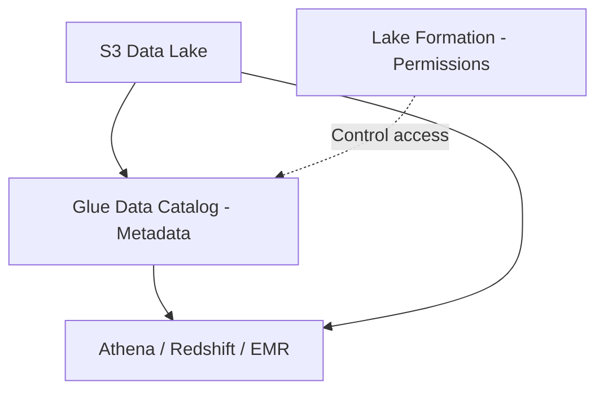

# 🌊 20-07. AWS Lake Formation

> **Keyword: Data Lake / Centralized Permissions / Fine-grained Access**

## 🇰🇷 1. Data Lake란?

Data Lake는 여러 형태의 데이터를 분석 목적으로 모아두는 **중앙화된 저장소/아키텍처**이다. AWS에서는 주로 S3를 저장소로 사용한다.

- 정형 데이터: RDS 주문 테이블, CSV 등.
- 반정형 데이터: JSON 이벤트, 로그 등.
- 비정형 데이터: 이미지, 문서 등.
- 데이터를 저장하는 물리 장소는 보통 **Amazon S3**이다.

AWS Lake Formation은 S3 기반 데이터 레이크의 구축과 **중앙 집중식 데이터 권한 관리**를 돕는 관리형 서비스다.

## 🇰🇷 2. Glue vs Lake Formation

| Component | Responsibility |
|---|---|
| **Amazon S3** | 실제 원본 및 가공 데이터 저장 |
| **Glue Crawler** | 데이터 구조 조사 |
| **Glue Data Catalog** | 데이터 구조·위치 메타데이터 저장 |
| **Glue ETL** | 원본 파일 변환·적재 |
| **Lake Formation** | 데이터 레이크 거버넌스·권한 중앙화 |
| **Athena/Redshift/EMR** | 승인된 데이터를 조회·처리 |



Lake Formation이 모든 사용자 데이터를 직접 저장·변환한다는 뜻이 아니다. AWS Glue 및 S3와 연계한다.

## 🇰🇷 3. Centralized Fine-grained Permissions

예시: 회사의 주문 테이블에 다음 컬럼이 존재한다.

| order_id | region | customer | sales |
|---|---|---|---|
| 1001 | Seoul | Kim | 50000 |
| 1002 | Busan | Lee | 30000 |

요구사항: 서울 지점 직원은 **서울 주문만** 보고, **고객 이름은 볼 수 없어야 함**.

- **Row-level security:** `region = 'Seoul'`인 행만 허용.
- **Column-level security:** `customer` 컬럼 접근 제한.
- 여러 분석 서비스가 같은 거버넌스 규칙을 공유하도록 권한을 중앙화할 수 있다(각 서비스의 지원 범위 확인).

> Lake Formation이 IAM이나 S3 Bucket Policy 전체를 대체하지 않는다. 서비스 사용 권한, S3 접근 경로, Lake Formation 통합 여부를 함께 고려한다.

## 🇰🇷 4. Blueprint / Data Lake Setup

Lake Formation의 데이터 수집 Blueprint는 데이터 수집·카탈로그·ETL 워크플로 구성을 단순화한다.

```text
RDS / S3 / Supported Source
            ↓
Data Ingestion / ETL
            ↓
     S3 Data Lake
            ↓
   Glue Data Catalog
            ↓
Lake Formation Permissions
            ↓
     Athena / BI
```

## 🎯 Exam Notes

- **Create and govern a data lake → Lake Formation**.
- **Centralize data permissions across analytics tools → Lake Formation**.
- **Row-/Column-level fine-grained access → Lake Formation**.
- **Discover schema → Glue Crawler**.
- **Store table metadata → Glue Data Catalog**.
- **SQL over data lake → Athena**.

## 🇯🇵 日本語 Summary

Lake Formation は S3 ベースのデータレイク構築と権限管理を支援するサービス。Glue Data Catalog はデータの構造と場所を保存し、Lake Formation は誰がどの行・列にアクセスできるかを一元管理する。IAM と S3 ポリシーも引き続き必要になる。

## 🇺🇸 English Summary

AWS Lake Formation helps establish and govern data lakes. S3 holds the actual data, Glue Data Catalog stores metadata, and Lake Formation centralizes fine-grained permissions, including row- and column-level controls for supported analytics workflows. It complements rather than replaces IAM and S3 policies.

## 📚 Vocabulary

| English | 한국어 | 日本語 |
|---|---|---|
| Data Lake | 데이터 레이크 | データレイク |
| Governance | 데이터 거버넌스 | データガバナンス |
| Fine-grained Access | 세분화된 접근 제어 | きめ細かなアクセス制御 |
| Row-level Security | 행 수준 보안 | 行レベルセキュリティ |
| Column-level Security | 열 수준 보안 | 列レベルセキュリティ |
