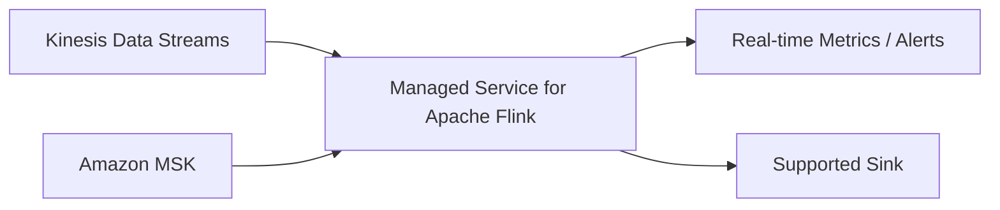

# 🌊 20-08. Apache Flink Streaming Analytics

> Kinesis Data Analytics 개요 + 콘솔 실습  
> **Keyword: Real-time Analytics / Window / Checkpoint / Flink**

## 🇰🇷 1. Current Service Names

강의는 Kinesis Data Analytics를 SQL용과 Apache Flink용으로 구분하지만, **2026-10 기준 현행 서비스는 다음과 같다.**

| 과거 명칭 | 현재 상태 |
|---|---|
| Kinesis Data Analytics for SQL Applications | **2026-01-27부터 사용·지원 종료** |
| Kinesis Data Analytics for Apache Flink | **Amazon Managed Service for Apache Flink**로 이름 변경 |

SQL 언어 자체를 사용하지 못한다는 뜻이 아니다. **Apache Flink는 Flink SQL을 지원**한다.

## 🇰🇷 2. Streaming Analytics



- 이벤트가 계속 들어오면 Flink가 지속적으로 처리한다.
- 시간 창(**Window**) 단위 집계, 상태 기반 연산, JOIN, 이벤트 시간 처리 등에 적합하다.
- 예: '최근 1분 동안 발생한 결제 실패 횟수'.

```text
10:00:00 ~ 10:00:59 -> Failed Payments = 3
10:01:00 ~ 10:01:59 -> Failed Payments = 1
```

**Streams/MSK는 데이터를 전달하는 플랫폼, Flink는 스트림을 분석하는 엔진**이다.

## 🇰🇷 3. Input / Output & Firehose

- 대표 Flink 스트리밍 입력: **Kinesis Data Streams, Amazon MSK(Apache Kafka)**.
- 결과는 지원 커넥터·설정에 맞는 서비스로 전송한다.
- **Amazon Data Firehose는 일반적으로 데이터를 버퍼링하고 대상에 전달하는 서비스**. Flink의 대표적인 직접 입력 소스로 암기하지 않는다.
- 과거 SQL Applications에서는 Firehose 입력을 지원했지만 서비스가 종료되었다.

## 🇰🇷 4. Checkpoint vs Snapshot

| Feature | Meaning |
|---|---|
| **Checkpoint** | 상태를 주기적으로 보존해 장애 복구에 활용 |
| **Snapshot** | 애플리케이션 상태를 특정 시점에 보존해 복원·변경 작업에 활용 |

Flink는 데이터 처리 위치뿐 아니라 진행 중인 집계 상태 등을 보존할 수 있다. 관리형 서비스가 자동 확장과 컴퓨팅 자원 관리 부담을 줄여준다.

## 🇰🇷 5. Console Lab: Streaming Application vs Studio Notebook

| Option | When to use |
|---|---|
| **Streaming Application** | 작성·빌드한 Flink 애플리케이션을 배포하고 지속 실행 |
| **Studio Notebook** | Flink SQL 등으로 데이터를 탐색·실험한 후 필요하면 애플리케이션으로 배포 |

```text
Flink Code → Build JAR → Upload to S3 → Managed Service for Apache Flink
```

이때 **S3의 JAR는 입력 데이터가 아니라 실행 프로그램 아티팩트**다. 입력 데이터는 Kinesis/MSK에서 별도로 읽는다.

## 🎯 Exam Notes

- **Stateful Real-time Analytics / Streaming Window → Managed Service for Apache Flink**.
- **Kinesis Streams or MSK → Flink Input**.
- **Fault Recovery → Checkpoint**.
- **Flink development/prototyping → Studio Notebook**.
- **Kinesis Data Analytics SQL Legacy → 지원 종료된 과거 서비스**.

## 🇯🇵 日本語 Summary

Kinesis Data Analytics for SQL Applications は 2026 年 1 月に終了した。現行の Managed Service for Apache Flink は Kinesis Data Streams や Amazon MSK のイベントを継続的に処理する。Window 集計、Checkpoint、Snapshot などを利用し、Studio Notebook では対話的に開発できる。

## 🇺🇸 English Summary

The legacy Kinesis Data Analytics SQL application service has been discontinued. Amazon Managed Service for Apache Flink performs continuous stateful stream analytics over Kinesis Data Streams or MSK. Windows aggregate events over time; checkpoints and snapshots support recovery. Studio notebooks aid interactive development.

## 📚 Vocabulary

| English | 한국어 | 日本語 |
|---|---|---|
| Streaming | 스트리밍 | ストリーミング |
| Window | 시간 창 | ウィンドウ |
| Checkpoint | 처리 상태 저장점 | チェックポイント |
| Snapshot | 특정 시점 상태 백업 | スナップショット |
| Stateful Processing | 상태 기반 처리 | ステートフル処理 |

## 📚 Official References

- [SQL Applications end of support](https://docs.aws.amazon.com/kinesisanalytics/latest/dev/discontinuation.html)
