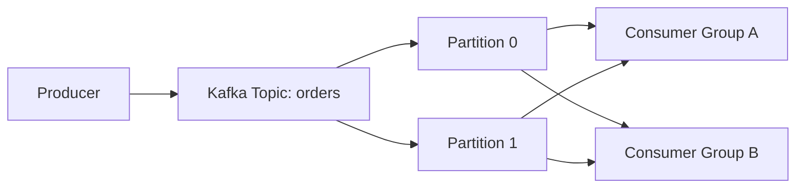

# 📨 20-09. Amazon MSK

> **Keyword: Managed Apache Kafka / Broker / Topic / Partition**

## 🇰🇷 1. Overview

Amazon MSK(Managed Streaming for Apache Kafka)는 **Apache Kafka를 AWS에서 관리형으로 실행**하는 스트리밍 서비스다.

- Kinesis Data Streams의 대안이 될 수 있다.
- 기존 Kafka 클라이언트/API 및 Kafka 생태계를 활용할 때 유리하다.
- Provisioned는 Broker 구성과 용량을 관리, Serverless는 이를 상당 부분 자동화한다.
- 다중 AZ 배포·Broker 장애 복구 등 클러스터 운영을 지원한다.

## 🇰🇷 2. Kafka 기본 구성

| Concept | Meaning |
|---|---|
| **Producer** | Kafka로 이벤트를 보내는 애플리케이션 |
| **Topic** | 주문/결제처럼 이벤트 종류를 구분하는 논리적 스트림 |
| **Partition** | Topic을 나누어 병렬 처리·순서 보장 범위를 정하는 단위 |
| **Broker** | Partition을 저장하고 Producer/Consumer 요청을 처리하는 서버 |
| **Consumer** | Topic에서 이벤트를 읽어 처리하는 애플리케이션 |
| **Consumer Group** | 동일 그룹 내에서 Partition 처리 업무를 분배하는 단위 |



- Partition 안의 메시지 순서는 보장되지만 **Topic 전체에 걸친 전역 순서는 보장되지 않는다**.
- Topic은 Kafka의 보존 정책에 따라 데이터를 유지한다. Consumer가 읽었다고 즉시 삭제되는 구조가 아니다.
- Replication Factor=3이면 특정 Partition에 세 복제본을 둘 수 있다. **모든 Broker에 모든 Topic 데이터가 복제되는 것은 아니다.**

## 🇰🇷 3. Kinesis Data Streams vs Amazon MSK

| Comparison | Kinesis Data Streams | Amazon MSK |
|---|---|---|
| 기반 | AWS 네이티브 스트림 | Apache Kafka |
| 분산 단위 | **Shard** | **Topic Partition** |
| 클라이언트 | Kinesis API / SDK | Kafka Producer / Consumer API |
| 처리 앱 | Lambda, Flink 등 | Flink, Glue Streaming ETL, Lambda, Kafka Consumer 등 |
| 주요 선택 기준 | AWS 네이티브 구축 | Kafka 호환성·이전 |

**강의 시점과 달라진 부분:** Kinesis의 레코드 크기는 기본 1MiB이고, 지원되는 대형 레코드 설정으로 최대 10MiB까지 가능하다. 암호화·크기·파티션 기능은 각 서비스의 구성 제약에 따라 다르므로 숫자만 고정 암기하지 않는다.

## 🇰🇷 4. MSK Provisioned / Serverless & Storage

- Provisioned: Broker 타입/용량 등을 선택한다.
- Serverless: 용량 프로비저닝과 규모 조절을 AWS가 관리한다.
- 기존 Standard Broker는 EBS를 활용하고, 최신 Broker 유형은 스토리지 관리 모델이 다를 수 있다.
- 과거 Kafka는 ZooKeeper를 사용했으나, 현재 Kafka/MSK는 **KRaft** 기반 구성도 지원한다.
- 데이터 보관은 Topic 정책과 스토리지 용량·비용의 제약을 받는다.

## 🇰🇷 5. Consumers / Architecture

```text
Amazon MSK (Kafka Topic)
    ├── AWS Lambda → Event Handler
    ├── Managed Service for Apache Flink → Stateful Streaming Analytics
    ├── Glue Streaming ETL → Transformation
    └── EC2 / ECS / EKS → Custom Kafka Consumer
```

## 🎯 Exam Notes

- **Existing Kafka workloads on AWS → Amazon MSK**.
- **Serverless Kafka Capacity → MSK Serverless**.
- **Kafka Topic Partition ≈ Kinesis Shard**(유사하나 완전 동일하진 않다).
- **Kafka Broker = 데이터 저장 및 요청 처리 서버**.
- **Streaming real-time analysis of MSK events → Managed Service for Apache Flink**.

## 🇯🇵 日本語 Summary

Amazon MSK は Apache Kafka のフルマネージドサービス。Producer が Topic に書き込み、Topic は Partition に分割される。Broker はデータを保持し、Consumer はイベントを読み取る。既存 Kafka アプリケーションを AWS に移行する際の候補となる。

## 🇺🇸 English Summary

Amazon MSK is a managed Apache Kafka service. Producers publish to topics, partitions distribute records, brokers host the data, and consumers process events. Partition order is preserved within a partition. MSK Serverless reduces capacity management, while MSK integrates with Lambda, Glue, Flink, and custom Kafka consumers.

## 📚 Vocabulary

| English | 한국어 | 日本語 |
|---|---|---|
| Broker | Kafka 데이터 서버 | ブローカー |
| Topic | 이벤트 분류 | トピック |
| Partition | 분할 저장·처리 단위 | パーティション |
| Producer | 데이터 생산자 | プロデューサー |
| Consumer | 데이터 소비자 | コンシューマー |
