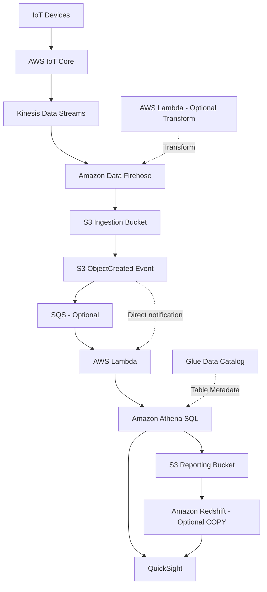
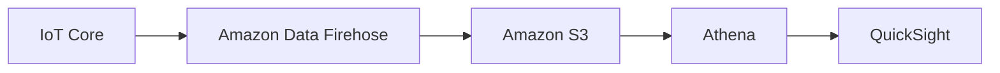

# 🏗️ 20-10. Big Data Ingestion Pipeline

> **Keyword: IoT → Streams → Firehose → S3 → Athena → QuickSight**

## 🇰🇷 1. Business Requirements

- IoT 센서 등에서 **실시간 데이터 수집**.
- 원본 데이터를 정리하고 **Amazon S3에 저장**.
- 저장된 데이터를 **SQL로 분석**.
- SQL 결과는 **별도 Reporting S3 경로에 저장**.
- 필요하면 **Redshift 데이터 웨어하우스에 적재**.
- **QuickSight**로 결과를 시각화.
- 가능한 범위에서 서버리스·관리형 서비스 사용.

## 🇰🇷 2. Reference Architecture



**위 구조는 요구사항을 보여주기 위한 참조 예시. 모든 서비스가 필수는 아니다.**

## 🇰🇷 3. Service-by-service Flow

| Step | Service | Responsibility |
|---|---|---|
| 1 | **AWS IoT Core** | IoT 기기 연결, 메시지 수신, Rule로 다른 AWS 서비스 전달 |
| 2 | **Kinesis Data Streams** | 이벤트 실시간 수집, 여러 소비자가 독립적으로 읽을 수 있는 스트림 |
| 3 | **Amazon Data Firehose** | 이벤트 버퍼링 및 대상(S3 등)으로 관리형 전달 |
| 4 | **AWS Lambda (optional)** | Firehose 전달 중 필요한 데이터 변환 |
| 5 | **S3 Ingestion Bucket** | 원본/정제된 수집 데이터 저장 |
| 6 | **S3 Event / SQS / Lambda** | 객체 도착 시 비동기 SQL 분석 트리거 |
| 7 | **Athena + Glue Data Catalog** | S3 파일 구조 확인 + SQL 실행 |
| 8 | **S3 Reporting Bucket** | SQL 결과 파일 저장 |
| 9 | **Redshift (optional)** | 결과를 웨어하우스에 적재하여 복잡한 추가 분석 |
| 10 | **QuickSight** | Athena 또는 Redshift 결과를 대시보드로 시각화 |

### S3 Event → Lambda 또는 SQS → Lambda

```text
Option A: S3 ObjectCreated → Lambda
Option B: S3 ObjectCreated → SQS → Lambda
```

SQS는 **이벤트 메시지 버퍼링/재시도**를 위한 선택 사항이다. SQS에 모든 원본 센서 데이터를 복사할 필요는 없다.

Lambda는 Athena의 `StartQueryExecution`으로 쿼리를 요청할 수 있다. 쿼리 실행은 비동기이므로 완료 여부를 확인해야 후속 작업을 안정적으로 연결할 수 있다.

## 🇰🇷 4. S3 원본 위치 vs 쿼리 결과 위치

| Bucket | Contents |
|---|---|
| `s3://factory-ingestion/` | IoT 센서 원본 및 변환 데이터 |
| `s3://factory-reporting/` | Athena SQL 결과 |

```sql
-- Glue Data Catalog에 sensor_logs 외부 테이블이 등록돼 있다고 가정
SELECT sensor_id, temperature, event_time
FROM factory_db.sensor_logs
WHERE temperature >= 35;
```

Athena는 조회 결과를 고객 관리 S3에 저장하거나, 워크그룹 설정에 따라 Athena Managed Query Results를 사용할 수 있다. **영구 보고서 보관이 필요하면 사용자 S3 저장을 별도로 설계**한다.

## 🇰🇷 5. Real-time vs Near-real-time vs Batch

- IoT Core / Kinesis Data Streams: 이벤트를 빠르게 수신·전달한다.
- Firehose: 버퍼링 설정에 따라 S3에 데이터를 나누어 저장한다. **강의의 '최소 1분'은 현재 고정 제약이 아니다.**
- Athena: S3에 도착한 데이터에 대한 SQL 분석. 수집이 실시간이어도 쿼리는 보통 파일 도착 후 실행된다.
- **수 초 이내 실시간 이상 감지가 목적이면 Managed Service for Apache Flink 등의 직접 스트림 분석을 검토**한다.

## 🇰🇷 6. Simplify the Architecture

'IoT 이벤트를 S3에 보관하고, 가끔 SQL로 분석하며 대시보드만 만들면 된다'면:



- Kinesis Data Streams는 별도 스트림 소비자가 필요할 때 추가할 수 있다.
- SQS는 이벤트 완충·재시도 등이 필요할 때 추가한다.
- Redshift는 복잡한 데이터 웨어하우징이 요구될 때 추가한다.
- Redshift 컴퓨팅까지 서버리스 요구라면 Redshift Serverless 사용을 검토한다.

**좋은 아키텍처 = 서비스를 최대한 많이 쓰는 것이 아니라 필요한 역할만 선택하는 것.**

## 🎯 Exam Notes

| Requirement | Candidate |
|---|---|
| Receive data from IoT devices | IoT Core |
| Real-time streaming & multiple consumers | Kinesis Data Streams |
| Deliver stream records to S3 | Amazon Data Firehose |
| Transform Firehose records | Lambda |
| Buffer object-created events | S3 Notification → SQS |
| Run SQL over stored files | Athena + Glue Data Catalog |
| Persist query outputs | S3 Query Results |
| Business dashboards | QuickSight |
| Analytical warehouse | Redshift |
| Continuous stateful stream analytics | Managed Service for Apache Flink |

## 🇯🇵 日本語 Summary

IoT Core でデバイスデータを受信し、Kinesis Data Streams でストリーミングし、Firehose で S3 に配信する。Lambda と Athena が保存されたデータを SQL で分析し、結果を Reporting Bucket に保存する。QuickSight は可視化、Redshift は必要に応じてデータウェアハウスを提供する。

## 🇺🇸 English Summary

An ingestion pipeline can receive IoT data through IoT Core and Kinesis Data Streams, deliver records to S3 with Firehose, and run Athena SQL on stored files. S3 notifications and Lambda can automate queries. QuickSight visualizes results and Redshift provides optional warehousing. Real-time ingestion does not guarantee real-time final analytics.

## 📚 Vocabulary

| English | 한국어 | 日本語 |
|---|---|---|
| Ingestion Pipeline | 데이터 수집 파이프라인 | 取り込みパイプライン |
| Data Transformation | 데이터 변환 | データ変換 |
| Reporting Bucket | 결과/보고서 버킷 | レポート用バケット |
| Near Real-Time | 준실시간 | ニアリアルタイム |
| Data Warehouse | 데이터 웨어하우스 | データウェアハウス |

## 📚 Official References

- [Amazon Data Firehose buffering](https://docs.aws.amazon.com/firehose/latest/dev/create-configure-backup.html)
- [Athena managed query results](https://docs.aws.amazon.com/athena/latest/ug/managed-results.html)
