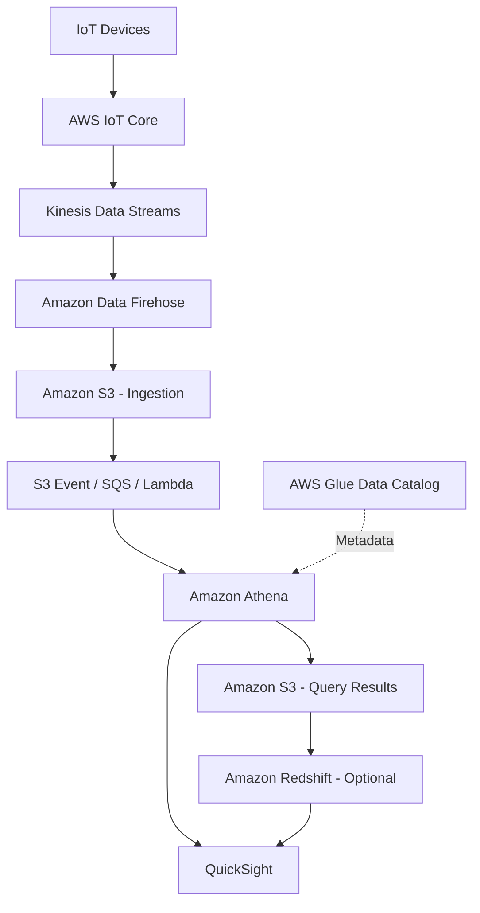

# 📊 20. Data & Analytics

> AWS Certified Solutions Architect – Associate (SAA-C03)  
> **Udemy Section 22 | GitHub Section 20**  
> 학습 기준: 2026-10-10 · 강의 슬라이드 v48 (Athena ~ Big Data Ingestion Pipeline)

## 📌 Overview

이번 섹션은 데이터의 **수집(Ingestion) → 저장(Storage) → 카탈로그(Catalog) → 변환(ETL) → 분석(Analytics) → 시각화(BI)** 흐름을 학습한다.

서비스의 수가 많더라도 각각을 무조건 조합하는 것이 목표가 아니다. **요구사항에 필요한 역할만 골라 가장 단순한 데이터 아키텍처를 설계**하는 것이 목표다.

## 🎯 Learning Objectives

1. Athena, Redshift, OpenSearch, EMR의 사용 목적을 구별한다.
2. Glue Crawler, Data Catalog, ETL, Lake Formation의 역할을 구분한다.
3. QuickSight의 SPICE/Direct Query 및 Analysis/Dashboard 차이를 설명한다.
4. Kinesis Data Streams, Amazon Data Firehose, Amazon MSK, Apache Flink를 선택할 수 있다.
5. IoT → Streaming → S3 → Athena → BI 형태의 데이터 파이프라인을 설계한다.
6. 강의에 남아 있는 종료·명칭 변경 서비스를 현행 아키텍처와 구분한다.

## 📂 Contents

| File | Description |
|---|---|
| [20-01-Amazon-Athena.md](./20-01-Amazon-Athena.md) | S3 SQL 분석, Athena 실습, 비용 최적화 |
| [20-02-Amazon-Redshift.md](./20-02-Amazon-Redshift.md) | OLAP·Data Warehouse, COPY, Spectrum, Snapshot |
| [20-03-Amazon-OpenSearch-Service.md](./20-03-Amazon-OpenSearch-Service.md) | 검색 엔진, DynamoDB Streams, 로그 검색 |
| [20-04-Amazon-EMR.md](./20-04-Amazon-EMR.md) | Hadoop·Spark, Primary/Core/Task, Spot |
| [20-05-Amazon-QuickSight.md](./20-05-Amazon-QuickSight.md) | BI, SPICE, Direct Query, Dataset/Analysis/Dashboard |
| [20-06-AWS-Glue.md](./20-06-AWS-Glue.md) | ETL, Crawler, Data Catalog, Job Bookmarks |
| [20-07-AWS-Lake-Formation.md](./20-07-AWS-Lake-Formation.md) | Data Lake, 중앙 권한 관리, 행·열 보안 |
| [20-08-Apache-Flink-Streaming-Analytics.md](./20-08-Apache-Flink-Streaming-Analytics.md) | 스트리밍 분석, Flink, 체크포인트, 콘솔 |
| [20-09-Amazon-MSK.md](./20-09-Amazon-MSK.md) | Kafka, Broker/Topic/Partition, Kinesis 비교 |
| [20-10-Big-Data-Ingestion-Pipeline.md](./20-10-Big-Data-Ingestion-Pipeline.md) | IoT → Kinesis → Firehose → S3 → Athena → BI |

## 🧭 Service Selection Guide

| Requirement | First Candidate | Why |
|---|---|---|
| S3 데이터 즉석 SQL 조회 | **Athena** | 원본 S3 데이터에 서버리스 SQL |
| 반복적인 복잡한 분석·대규모 JOIN | **Redshift** | OLAP 데이터 웨어하우스 |
| Redshift에서 S3 외부 데이터를 조회 | **Redshift Spectrum** | 적재 없이 외부 테이블 조회 |
| 웹/상품 전문 검색·로그 탐색 | **OpenSearch** | 전문 검색, 인덱싱, 대시보드 |
| Hadoop/Spark 대규모 분산 처리 | **EMR** | 빅데이터 프레임워크 실행 |
| 시각화·보고서 | **QuickSight / Quick Sight** | BI 대시보드 |
| 데이터 변환 및 포맷 변경 | **Glue ETL** | 추출·변환·적재 |
| 스키마 자동 수집 | **Glue Crawler** | 메타데이터 추론 |
| 스키마·S3 데이터 위치 저장 | **Glue Data Catalog** | 중앙 메타데이터 저장소 |
| 데이터 레이크 권한 중앙화 | **Lake Formation** | Fine-grained Access Control |
| 실시간 이벤트 보관·다중 소비 | **Kinesis Data Streams** | 실시간 스트리밍 플랫폼 |
| 스트림을 S3 등에 관리형 전달 | **Amazon Data Firehose** | 버퍼링·전달 |
| Apache Kafka 호환 스트리밍 | **Amazon MSK** | 관리형 Kafka |
| 상태 기반 실시간 분석 | **Managed Service for Apache Flink** | Window·Checkpoint 등 |

## 🏗️ End-to-End Architecture

- **S3 Ingestion:** 원본 파일 저장.
- **Glue Data Catalog:** 원본의 스키마 및 S3 위치를 관리. 데이터 자체를 저장하지 않는다.
- **Athena:** SQL 분석 엔진. 쿼리 결과를 S3 또는 Athena Managed Query Results에 저장할 수 있다.
- **Redshift:** 데이터 웨어하우스가 필요한 경우에만 추가.
- **QuickSight:** Athena/Redshift 등에서 조회한 데이터 시각화.
- **SQS / Lambda:** 비동기 트리거가 필요한 경우에만 구성.

> **실시간 수집(Streams) ≠ 실시간 최종 분석(Athena + S3 배치 쿼리).** 초 단위 복잡한 분석은 Flink 등 스트림 처리 엔진을 검토한다.

## ⚠️ 2026 Service Status / Exam Traps

- **Kinesis Data Analytics for SQL Applications:** 2026-01-27부터 사용·지원 종료. 역사적 용도로만 이해한다.
- **Kinesis Data Analytics for Apache Flink:** 현행 명칭은 **Amazon Managed Service for Apache Flink**.
- **Amazon QuickSight:** AWS BI 제품군 명칭이 변화했다. 현재 **Amazon Quick Sight**는 **Amazon Quick** 안의 BI 기능이며, 기존 QuickSight API/SDK 호환성은 유지된다.
- **Glue Elastic Views:** 오래된 강의의 Preview 기능. 현재 표준 AWS Glue 기능으로 학습하지 않는다.
- **Redshift:** PostgreSQL의 일반적인 보조 인덱스를 지원하지 않는다. Sort/Distribution Key 등을 이용한다.
- **Redshift / EMR / MSK:** 프로비저닝형과 Serverless 옵션을 구별한다.
- **Athena:** 사용자 S3 결과 버킷 외에 Athena 관리형 쿼리 결과(24시간 보관)도 가능하다.
- **Firehose S3 buffering:** 강의의 '최소 1분'은 고정 규칙이 아니다. 목적지별 설정 범위를 확인한다.

## 🎯 Final Review

**저장(S3) / 설명서(Glue Data Catalog) / 가공(Glue ETL) / 권한(Lake Formation) / SQL(Athena) / 검색(OpenSearch) / 웨어하우스(Redshift) / 대시보드(QuickSight) / 스트림(Kinesis·MSK) / 실시간 계산(Flink)**

## 🇯🇵 日本語 Summary

このセクションでは、データの収集・保存・メタデータ管理・ETL・分析・可視化を、AWS の各サービスで実現する方法を学習した。

Athena は S3 上の SQL 分析、Redshift はデータウェアハウス、OpenSearch は全文検索、EMR は大規模分散処理に適している。Glue Data Catalog はメタデータを管理し、Lake Formation はデータレイクの権限を一元管理する。

ストリーミングには Kinesis Data Streams / Amazon MSK、配信には Firehose、継続的な分析には Managed Service for Apache Flink を利用できる。

## 🇺🇸 English Summary

This section covers end-to-end analytics: ingestion, storage, metadata discovery, ETL, SQL analysis, data warehousing, search, and visualization. Athena queries S3, Redshift handles OLAP workloads, OpenSearch supports full-text search, and EMR runs distributed big-data frameworks. Glue manages metadata and ETL, while Lake Formation centralizes data-lake permissions. Kinesis/MSK provide streaming; Flink performs stateful stream processing.

## 📚 Official References

- [AWS Athena managed results](https://docs.aws.amazon.com/athena/latest/ug/managed-results.html)
- [Amazon Redshift Spectrum](https://docs.aws.amazon.com/redshift/latest/dg/c-spectrum-overview.html)
- [Kinesis Data Analytics SQL discontinuation](https://docs.aws.amazon.com/kinesisanalytics/latest/dev/discontinuation.html)
- [Amazon Quick current naming](https://docs.aws.amazon.com/quick/latest/userguide/what-is.html)
- [Amazon Data Firehose buffering](https://docs.aws.amazon.com/firehose/latest/dev/create-configure-backup.html)
