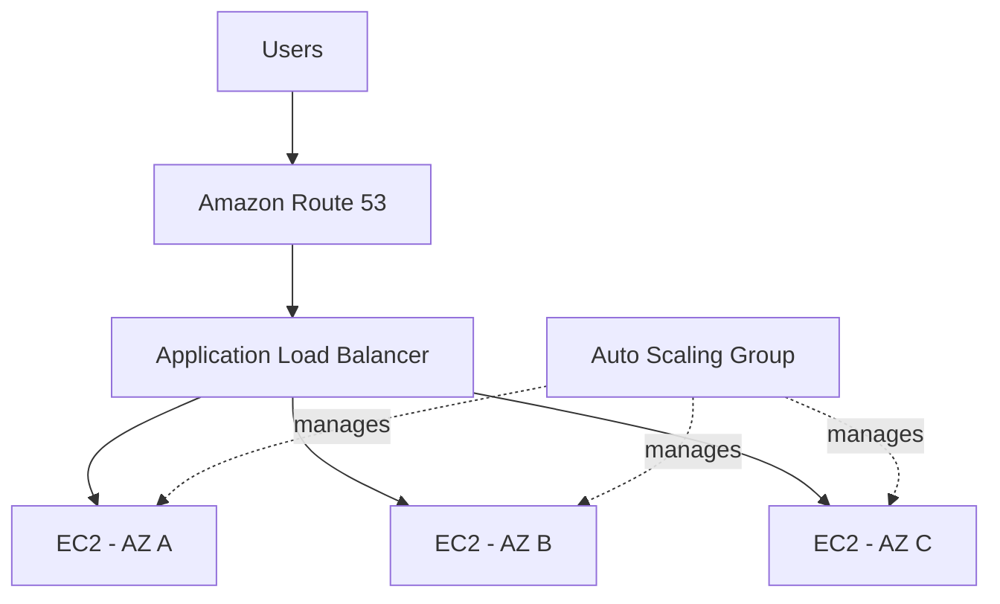

# 🕒 WhatIsTheTime.com

> **Architecture Design Project**
>
> A stateless web application evolving from a single EC2 instance into a horizontally scalable and highly available AWS architecture.

---

# 1. Project Overview

WhatIsTheTime.com은 사용자가 접속하면 현재 시간을 반환하는 단순한 Web Application이다.

Application 자체는 매우 단순하며 Database를 사용하지 않는다.

초기 단계에서는 Traffic이 적고 일시적인 Downtime도 허용할 수 있지만, 서비스가 성장하면서 다음 요구사항이 추가된다.

```text
Start Small
    ↓
Handle Increasing Traffic
    ↓
Scale Horizontally
    ↓
Minimize Downtime
    ↓
Survive Infrastructure Failure
```

이 프로젝트의 목적은 이러한 요구사항 변화에 따라 AWS Architecture를 단계적으로 발전시키는 것이다.

---

# 2. Requirements

## Functional Requirement

- 사용자가 Web Application에 접속할 수 있어야 한다.
- 현재 시간을 반환한다.
- Database는 필요하지 않다.

## Initial Requirements

- 작은 규모로 시작
- 낮은 Traffic
- 초기에는 Downtime 허용

## Growth Requirements

서비스가 성장하면 다음 조건을 만족해야 한다.

- 증가하는 Traffic 처리
- Horizontal Scaling
- Instance 장애 대응
- 자동 Scaling
- Availability Zone 장애 대응
- 사용자에게 안정적인 Endpoint 제공

---

# 3. Workload Characteristics

이 Application의 가장 중요한 특징은 **Stateless**라는 것이다.

사용자의 Session이나 Application State를 특정 EC2 Instance에 저장할 필요가 없다.

```text
Request 1 → EC2 A
Request 2 → EC2 B
Request 3 → EC2 C

모두 동일하게 처리 가능
```

따라서 어떤 EC2 Instance가 Request를 처리하더라도 결과에 문제가 없다.

이 특징은 Horizontal Scaling을 매우 쉽게 만든다.

> **Stateless Compute는 Instance를 추가하거나 제거하기 쉽다.**

---

# 4. Architecture Evolution

## Stage 1: Proof of Concept

초기에는 가장 단순한 Architecture로 시작한다.

```text
User
 ↓
Elastic IP
 ↓
EC2
```

### Components

- 1 × EC2 Instance
- 1 × Elastic IP
- Public Subnet

Elastic IP를 사용하면 EC2에 고정된 Public IPv4 Address를 제공할 수 있다.

### Why This Works

초기 Traffic이 적기 때문에 하나의 EC2 Instance만으로도 충분하다.

또한 초기 요구사항에서는 Downtime이 허용된다.

### Limitations

```text
Single EC2
    ↓
Single Point of Failure
```

EC2 Instance에 장애가 발생하면 서비스 전체가 중단된다.

또한 Traffic이 증가하면 하나의 Instance가 Bottleneck이 된다.

---

# 5. Stage 2: Vertical Scaling

Traffic이 증가하면 먼저 EC2 Instance 자체를 더 강력한 Instance Type으로 변경할 수 있다.

```text
Before

EC2
t2.micro

   ↓ Vertical Scaling

After

EC2
m5.large
```

## Design Decision

Compute Resource 자체가 부족하다면 더 큰 Instance Type을 사용하는 것이 가장 단순한 해결책이다.

## Problem

EC2 Instance Type을 변경하려면 Instance를 Stop하고 다시 Start해야 하는 상황이 발생할 수 있다.

```text
Stop
 ↓
Resize
 ↓
Start
```

이 과정에서는 Downtime이 발생한다.

또한 Vertical Scaling에는 결국 한계가 존재한다.

### Lesson

> **Vertical Scaling은 간단하지만 Downtime과 Scaling Limit이라는 문제가 있다.**

---

# 6. Stage 3: Horizontal Scaling

다음 단계에서는 하나의 강력한 Instance에 의존하는 대신 여러 EC2 Instance를 사용한다.

```text
             ┌── EC2 A
User ────────┼── EC2 B
             └── EC2 C
```

이를 Horizontal Scaling이라고 한다.

## Benefit

Traffic을 여러 Instance가 처리할 수 있다.

또한 하나의 Instance에 모든 Compute Capacity가 집중되지 않는다.

## New Problem

사용자가 여러 EC2의 IP Address를 직접 알아야 하는 구조는 현실적으로 관리하기 어렵다.

```text
EC2 A → IP A
EC2 B → IP B
EC2 C → IP C
```

Infrastructure가 변경될 때마다 사용자가 Backend Instance의 Address를 알아야 하는 구조는 적절하지 않다.

---

# 7. Stage 4: Route 53

사용자에게 IP Address 대신 Domain Name을 제공하기 위해 Amazon Route 53을 사용할 수 있다.

```text
User
 ↓
api.whatisthetime.com
 ↓
Route 53
 ↓
EC2 IP Addresses
```

예를 들어 DNS Record에 여러 EC2 Address를 등록할 수 있다.

## Improvement

사용자는 더 이상 EC2의 IP Address를 직접 입력할 필요가 없다.

```text
IP Address
→ Domain Name
```

## New Problem: DNS Caching

EC2 Instance 하나가 제거되었다고 가정한다.

```text
EC2 A ❌
EC2 B
EC2 C
```

Route 53 Record에서 EC2 A를 제거하더라도 DNS Resolver나 Client에는 이전 DNS 결과가 TTL 동안 Cache되어 있을 수 있다.

```text
Old DNS Cache

api.whatisthetime.com
        ↓
     EC2 A ❌
```

따라서 변화가 잦은 Backend Instance를 DNS Record에 직접 노출하는 구조에는 한계가 있다.

### Lesson

> **DNS는 이름을 안정적으로 제공하지만 Dynamic Backend Fleet을 직접 관리하는 Load Balancer는 아니다.**

---

# 8. Stage 5: Elastic Load Balancer

Backend EC2 Instance를 사용자에게 직접 노출하는 대신 Load Balancer를 앞에 배치한다.

```text
User
 ↓
Route 53
 ↓
Load Balancer
 ↓
┌─────────┬─────────┐
EC2 A     EC2 B     EC2 C
```

Route 53에서는 Load Balancer를 Alias Target으로 사용할 수 있다.

```text
Domain
 ↓
Route 53 Alias
 ↓
Load Balancer
```

## Responsibilities

Load Balancer는:

- Traffic을 여러 EC2에 분산
- Backend EC2를 사용자로부터 추상화
- Target Health Check 수행
- Unhealthy Instance로 Traffic 전달 방지

를 담당한다.

---

# 9. Security Group Design

Load Balancer가 도입되면서 Network Access도 계층화할 수 있다.

```text
Internet
   ↓
ALB Security Group
   ↓
EC2 Security Group
```

### Load Balancer SG

```text
Inbound
HTTP / HTTPS
Source: Internet
```

### EC2 SG

```text
Inbound
Application Port
Source: ALB Security Group
```

즉 Backend EC2는 Internet 전체에 Application Port를 공개할 필요가 없다.

```text
Internet
   ↓
[ ALB ]
   ↓
[ EC2 ]

Internet ─────X────→ EC2
```

---

# 10. Stage 6: Auto Scaling Group

Load Balancer를 사용하더라도 EC2 Instance를 사람이 직접 추가하고 제거한다면 운영 부담이 남는다.

Auto Scaling Group을 사용하여 EC2 Fleet을 자동으로 관리한다.

```text
                 ALB
                  ↓
          Auto Scaling Group
          /       |       \
       EC2 A    EC2 B    EC2 C
```

ASG는 설정된 Capacity와 Scaling Policy에 따라 Instance 수를 조절할 수 있다.

```text
Traffic ↑
   ↓
Scale Out
   ↓
EC2 추가

Traffic ↓
   ↓
Scale In
   ↓
EC2 제거
```

Load Balancer와 ASG를 함께 사용하면:

```text
ELB
→ Traffic Distribution

ASG
→ Compute Fleet Management
```

역할이 분리된다.

---

# 11. Stage 7: Multi-AZ High Availability

EC2 Instance가 여러 개 있더라도 모두 하나의 Availability Zone에 있다면 충분한 High Availability Architecture라고 할 수 없다.

```text
AZ-A

EC2
EC2
EC2

AZ-A Failure
     ↓
Entire Application Down
```

따라서 여러 Availability Zone에 Instance를 분산한다.

```text
                    ALB
                     ↓
              Auto Scaling Group
             /        |        \
            /         |         \
         AZ-A       AZ-B       AZ-C
          │           │          │
        EC2         EC2        EC2
```

한 Availability Zone에 장애가 발생하더라도 다른 AZ의 Instance가 Traffic을 처리할 수 있다.

```text
AZ-A ❌

AZ-B EC2 ✅
AZ-C EC2 ✅
```

---

# 12. Final Architecture



### Traffic Flow

```text
User
 ↓
Route 53
 ↓
Alias
 ↓
Application Load Balancer
 ↓
Healthy EC2 Target
```

### Management Flow

```text
Auto Scaling Group
 ↓
Launch / Replace / Terminate
 ↓
EC2 Fleet
```

---

# 13. Component Responsibilities

| Component | Responsibility |
|---|---|
| Route 53 | DNS Endpoint |
| ALB | Traffic Distribution & Health Checks |
| Auto Scaling Group | EC2 Fleet Management |
| EC2 | Application Compute |
| Multi-AZ | Availability Zone Failure Protection |
| Security Groups | Network Access Control |

각 서비스의 책임을 분리하는 것이 중요하다.

```text
Route 53
≠ Load Balancer

ALB
≠ Auto Scaling

ASG
≠ Application Server
```

각 Component는 서로 다른 문제를 해결한다.

---

# 14. Failure Scenarios

## EC2 Instance Failure

```text
EC2 A ❌
```

ALB Health Check가 해당 Instance를 Unhealthy로 판단하면 Healthy Target으로 Traffic을 전달한다.

ASG는 필요한 Capacity를 유지하기 위해 Replacement Instance를 생성할 수 있다.

---

## Traffic Spike

```text
Traffic ↑↑↑
```

Scaling Policy 조건에 따라 ASG가 새로운 EC2 Instance를 추가할 수 있다.

ALB는 새로 등록된 Healthy Target으로 Traffic을 분산한다.

---

## Availability Zone Failure

```text
AZ-A ❌
```

다른 Availability Zone의 EC2 Instance가 계속 Traffic을 처리할 수 있다.

따라서 Compute Tier를 여러 AZ에 분산하는 것이 중요하다.

---

# 15. Cost Considerations

항상 실행되어야 하는 최소 Compute Capacity가 예측 가능하다면 장기 Commitment 기반 할인 모델을 검토할 수 있다.

추가적인 변동 Capacity는 Workload 특성에 따라 다른 구매 옵션을 사용할 수 있다.

예:

```text
Predictable Base Capacity
→ Reserved / Commitment-based pricing

Variable Capacity
→ On-Demand

Interruption-tolerant Workload
→ Spot 검토 가능
```

중요한 점은 **Reserved Instance와 Capacity Reservation을 구분하는 것**이다.

- Reserved Instance → 장기 Commitment를 통한 비용 절감
- Capacity Reservation → 특정 AZ의 EC2 Capacity 확보

둘은 목적이 다르다.

---

# 16. Design Decisions

| Problem | Decision | Reason |
|---|---|---|
| Single EC2 Capacity 부족 | Vertical Scaling | 가장 단순한 초기 Scaling |
| Vertical Scaling 한계 | Horizontal Scaling | 여러 Instance로 Load 분산 |
| 사용자가 여러 IP를 관리 | Route 53 | Stable Domain 제공 |
| Dynamic Backend 관리 | Load Balancer | Backend 추상화 및 Traffic 분산 |
| Manual Instance 관리 | Auto Scaling Group | Fleet 자동 관리 |
| Instance Failure | ALB Health Check + ASG | Unhealthy Target 제거 및 Replacement |
| AZ Failure | Multi-AZ | 다른 AZ에서 서비스 지속 |
| Backend 직접 접근 | SG Reference | ALB를 통한 Traffic만 허용 |

---

# 17. Trade-offs

## Single EC2

**장점**

- 단순함
- 관리하기 쉬움
- 작은 Workload에 적합

**단점**

- Single Point of Failure
- Scaling 한계

## Horizontal Scaling

**장점**

- Traffic 증가 대응
- Instance 추가/제거 가능

**단점**

- Architecture 복잡도 증가
- Traffic Distribution 필요

## Multi-AZ

**장점**

- Availability 향상
- AZ Failure 대응

**단점**

- 더 많은 Resource 필요
- 비용과 운영 복잡도 증가 가능

---

# 18. Key Lessons

이 Architecture의 핵심은 최종 Diagram 자체가 아니다.

Architecture가 다음과 같이 **요구사항에 따라 진화했다는 것**이 중요하다.

```text
Single EC2
    ↓
Vertical Scaling
    ↓
Horizontal Scaling
    ↓
Route 53
    ↓
Elastic Load Balancer
    ↓
Auto Scaling Group
    ↓
Multi-AZ
```

각 단계는 이전 단계에서 발생한 새로운 문제를 해결한다.

최종적으로 Compute Tier는 다음 특성을 가진다.

```text
Stateless
+
Horizontally Scalable
+
Load Balanced
+
Automatically Scaled
+
Multi-AZ
```

---

# 19. 日本語 Architecture Summary

## 目的

WhatIsTheTime.comは、データベースを必要としないStatelessなWeb Applicationです。

最初は1台のEC2 Instanceから開始し、Trafficの増加とAvailability要件に応じてArchitectureを段階的に改善しました。

## Architecture Evolution

```text
Single EC2
→ Vertical Scaling
→ Horizontal Scaling
→ Route 53
→ Load Balancer
→ Auto Scaling Group
→ Multi-AZ
```

## Final Design

- Route 53によるDNS
- Application Load BalancerによるTraffic分散
- Auto Scaling GroupによるEC2 Fleet管理
- 複数Availability ZoneによるHigh Availability
- Security Group ReferenceによるBackend保護

このArchitectureでは、StatelessなApplicationの特徴を利用することでEC2 Instanceを自由に追加・交換できる構成を実現します。

---

# 20. English Architecture Summary

## Objective

WhatIsTheTime.com is a simple stateless web application without a database.

The architecture begins with a single EC2 instance and evolves as traffic and availability requirements increase.

## Architecture Evolution

```text
Single EC2
→ Vertical Scaling
→ Horizontal Scaling
→ Route 53
→ Elastic Load Balancing
→ Auto Scaling
→ Multi-AZ
```

## Final Design

The final architecture uses:

- Amazon Route 53 for DNS
- An Application Load Balancer for traffic distribution and health checks
- An Auto Scaling Group for EC2 fleet management
- Multiple Availability Zones for high availability
- Security Group references to restrict direct backend access

Because the application is stateless, EC2 instances can be added, removed, or replaced without storing user-specific state on individual compute nodes.

---

# 21. Architecture Vocabulary

| English | 日本語 | 한국어 |
|---|---|---|
| Stateless | ステートレス | 상태 비저장 |
| Vertical Scaling | 垂直スケーリング | 수직 확장 |
| Horizontal Scaling | 水平スケーリング | 수평 확장 |
| Load Balancer | ロードバランサー | 로드 밸런서 |
| Auto Scaling | オートスケーリング | 자동 확장 |
| High Availability | 高可用性 | 고가용성 |
| Multi-AZ | マルチAZ | 다중 가용 영역 |
| Single Point of Failure | 単一障害点 | 단일 장애점 |
| Health Check | ヘルスチェック | 상태 확인 |
| Failure Scenario | 障害シナリオ | 장애 시나리오 |
| Design Decision | 設計判断 | 설계 결정 |
| Trade-off | トレードオフ | 상충 관계 |
