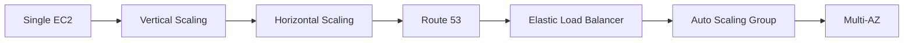
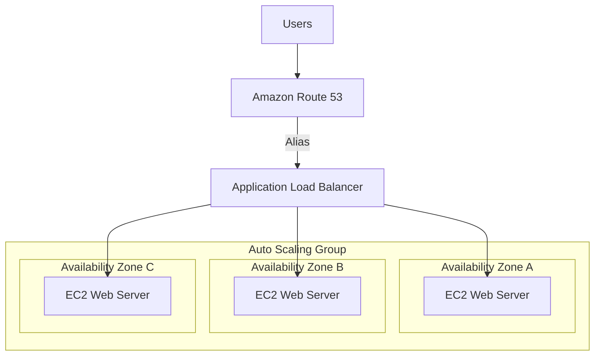
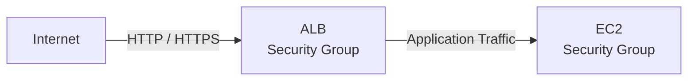

# WhatIsTheTime.com - Architecture

## Architecture Evolution



---

## Final Architecture



---

## Traffic Flow

```text
User
 ↓
Route 53
 ↓
Application Load Balancer
 ↓
Healthy EC2 Instance
 ↓
Application Response
```

---

## Security Boundary



EC2 Security Group은 Internet 전체가 아니라 ALB Security Group을 Source로 허용한다.

---

## Scaling

```text
Traffic Increase
      ↓
Scaling Policy
      ↓
Auto Scaling Group
      ↓
Launch EC2
      ↓
Health Check
      ↓
ALB Target
```

---

## Failure Handling

```text
EC2 Failure
→ ALB removes unhealthy target
→ ASG replaces instance

Traffic Spike
→ ASG scales out
→ ALB distributes traffic

AZ Failure
→ Instances in other AZs continue serving traffic
```

---

## Architecture Principles

```text
Stateless Compute
      +
Load Balancing
      +
Automatic Scaling
      +
Multi-AZ
      =
Scalable & Highly Available Web Tier
```
