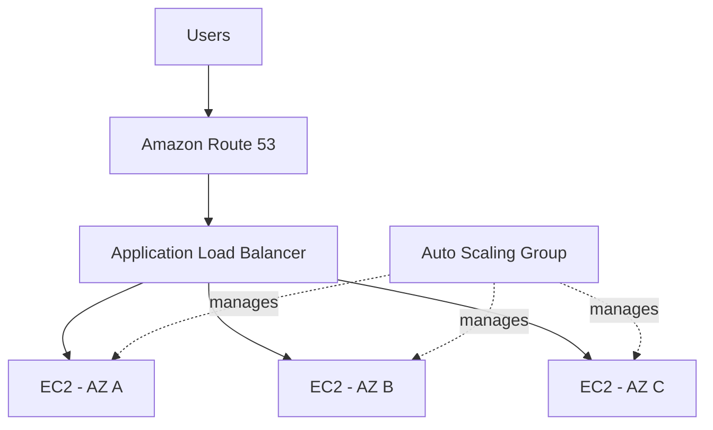
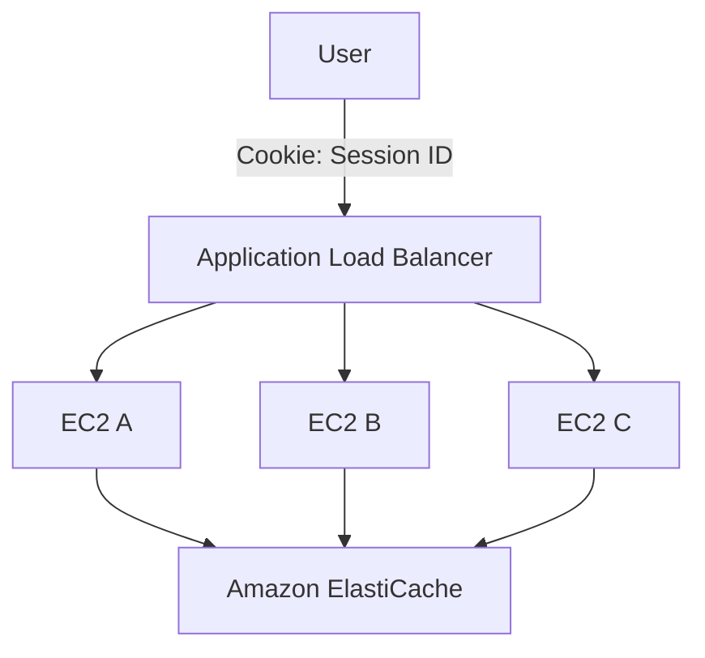
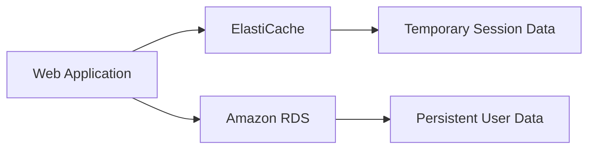
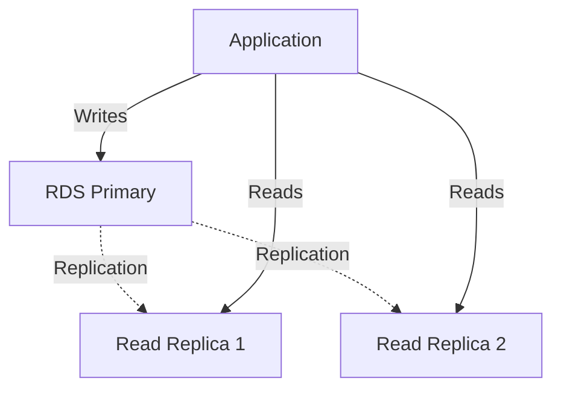
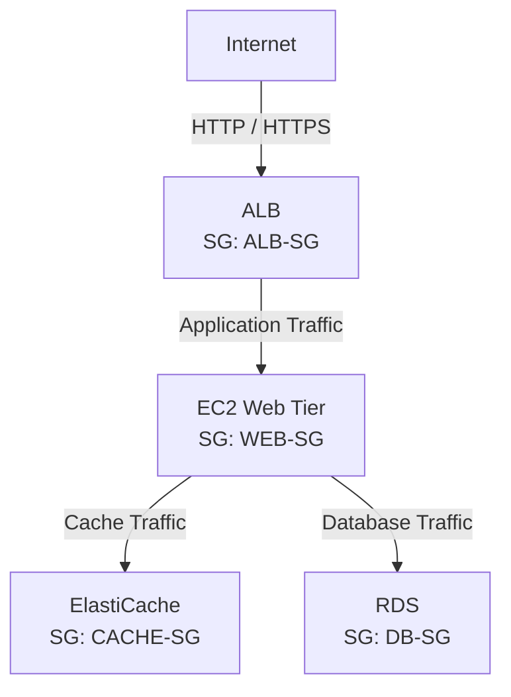
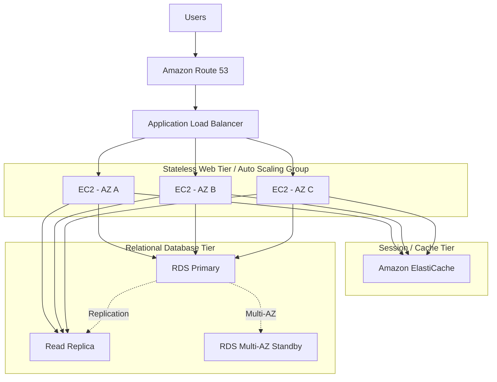

# 👕 MyClothes.com

> **Architecture Design Project**
>
> A stateful e-commerce application redesigned into a horizontally scalable stateless web architecture using external session storage, caching, and a highly available relational database.

---

# 1. Project Overview

MyClothes.com은 사용자가 상품을 확인하고 Shopping Cart에 상품을 추가할 수 있는 Online Clothing Store이다.

WhatIsTheTime.com과 달리 사용자의 상태를 관리해야 한다.

예를 들어:

```text
User A
├── Shopping Cart
├── Session
├── Name
└── Address
```

Application을 하나의 EC2 Instance에서 실행한다면 이러한 상태를 해당 Instance에서 관리할 수도 있다.

하지만 Web Tier를 Horizontal Scaling하면 문제가 발생한다.

```text
Request 1 → EC2 A
Request 2 → EC2 B
Request 3 → EC2 C
```

각 Request가 서로 다른 EC2 Instance로 전달될 수 있기 때문이다.

이 프로젝트의 핵심 목표는:

> **Application State를 개별 EC2 Instance에서 분리하여 Web Tier를 Stateless하게 만드는 것**

이다.

---

# 2. Requirements

## Application Requirements

- 사용자는 Shopping Cart를 사용할 수 있어야 한다.
- 사용자의 Session이 유지되어야 한다.
- Name, Address 등의 User Data를 저장해야 한다.
- 여러 사용자의 Request를 동시에 처리할 수 있어야 한다.

## Scalability Requirements

- EC2 Instance를 Horizontal Scaling할 수 있어야 한다.
- 특정 EC2 Instance에 사용자가 종속되어서는 안 된다.
- Database Read Traffic 증가에 대응할 수 있어야 한다.

## Availability Requirements

- EC2 Instance 장애가 전체 서비스 장애로 이어져서는 안 된다.
- Availability Zone 장애에 대응할 수 있어야 한다.
- Database와 Session Store 역시 고가용성을 고려해야 한다.

## Security Requirements

- Backend EC2를 Internet에 직접 노출하지 않는다.
- Database와 Cache는 Web Tier를 통해서만 접근할 수 있도록 제한한다.

---

# 3. Initial Architecture

WhatIsTheTime.com에서 만든 기본적인 Web Architecture를 시작점으로 사용한다.



Compute Scaling 자체는 이미 가능하다.

하지만 MyClothes.com에는 새로운 문제가 존재한다.

```text
State
```

---

# 4. Problem: Local Session State

사용자 A가 EC2 A에 접속하여 Shopping Cart에 상품을 추가했다고 가정한다.

```text
User A
  ↓
EC2 A
  ↓
Cart = [Shirt, Pants]
```

Shopping Cart를 EC2 A의 Local State에 저장한다.

다음 Request가 EC2 B로 전달된다면:

```text
User A
  ↓
ALB
  ↓
EC2 B

Cart = ?
```

EC2 B에는 EC2 A에 저장된 Session Data가 없다.

따라서 Shopping Cart가 사라진 것처럼 보일 수 있다.

---

# 5. Architecture Goal

Horizontal Scaling을 제대로 활용하려면 EC2 Instance를 가능한 한 **Disposable Compute**로 만들어야 한다.

즉:

```text
EC2 A가 죽어도
User State가 사라지지 않아야 한다.

EC2 B로 Request가 가도
동일한 State를 사용할 수 있어야 한다.

EC2 C가 새로 생성되어도
기존 User를 처리할 수 있어야 한다.
```

목표 Architecture는 다음과 같다.

```text
Stateful Application
        ↓
Externalize State
        ↓
Stateless Web Tier
```

---

# 6. Option 1: ELB Stickiness

첫 번째 방법은 Load Balancer의 Stickiness를 사용하는 것이다.

Stickiness 또는 Session Affinity를 사용하면 동일한 Client의 Request를 동일한 Backend Instance로 전달할 수 있다.

```text
User A
  ↓
 ALB
  ↓
EC2 A

Request 1 → EC2 A
Request 2 → EC2 A
Request 3 → EC2 A
```

## Benefit

기존 Application 구조를 크게 변경하지 않고 Session을 유지할 수 있다.

## Problem

State 자체는 여전히 EC2 A에 존재한다.

```text
User A
 ↓
EC2 A
 ↓
Session
```

EC2 A가 종료되면:

```text
EC2 A ❌
   ↓
Session ❌
```

따라서 Stickiness는 Request Routing 문제를 완화하지만 **State를 Compute에서 분리하지는 않는다.**

### Design Assessment

```text
Stickiness
→ Same Client → Same EC2

하지만

State
→ 여전히 EC2에 종속
```

---

# 7. Option 2: Store State in Client Cookies

두 번째 방법은 Shopping Cart 자체를 Client Cookie에 저장하는 것이다.

```text
Browser Cookie

Cart:
- Shirt
- Pants
```

Client는 Request를 보낼 때 Cookie를 함께 전송한다.

```text
User
 │
 │ Cookie: Cart Data
 ▼
ALB
 │
 ├── EC2 A
 ├── EC2 B
 └── EC2 C
```

어떤 EC2가 Request를 처리하더라도 Client가 State를 전달하기 때문에 동일한 정보를 확인할 수 있다.

## Benefit

Web Tier가 Stateless해진다.

```text
State
EC2 ❌
Client Cookie ✅
```

## Problems

Cookie에 많은 정보를 저장하면 Request 크기가 증가한다.

```text
Every Request
+
Shopping Cart Data
+
Cookie
```

또한 Cookie는 Client 측에 있기 때문에 사용자가 내용을 변경할 가능성도 고려해야 한다.

따라서 Application은 Client에서 전달된 값을 신뢰하지 않고 적절하게 검증해야 한다.

강의에서 다룬 Cookie 크기 기준은 4 KB 미만이다.

### Design Assessment

```text
장점
→ Stateless Web Tier

단점
→ Request Size 증가
→ Client-side Data
→ Tampering Risk
→ Limited Cookie Size
```

---

# 8. Selected Design: Session ID + ElastiCache

더 나은 방법은 Client에 전체 Session Data를 저장하지 않고 **Session ID만 저장하는 것**이다.

```text
Browser

Cookie:
session_id = abc123
```

실제 Session Data는 Server-side Session Store에 저장한다.

```text
session_id: abc123
        ↓
ElastiCache
        ↓
Cart:
- Shirt
- Pants
```

Architecture는 다음과 같이 변한다.



이제 어떤 EC2 Instance가 Request를 처리해도 같은 Session Store에 접근할 수 있다.

```text
Request 1
User → EC2 A → ElastiCache

Request 2
User → EC2 B → ElastiCache

Request 3
User → EC2 C → ElastiCache
```

모두 같은 Session Data를 사용할 수 있다.

---

# 9. Why ElastiCache?

Session Data는 일반적으로 빠른 접근이 필요한 임시 데이터이다.

ElastiCache와 같은 In-Memory Store를 사용하면 낮은 Latency로 Session Data에 접근할 수 있다.

```text
Session ID
    ↓
ElastiCache
    ↓
Session Data
```

이를 통해 Web Tier와 State를 분리할 수 있다.

```text
Before

EC2
├── Compute
└── Session


After

EC2
└── Compute

ElastiCache
└── Session
```

이 변화가 이 Architecture의 가장 중요한 Design Decision이다.

> **Compute와 State의 Lifecycle을 분리한다.**

EC2 Instance가 교체되어도 Session Store는 별도로 존재한다.

---

# 10. Stateless Web Tier

Session을 외부로 분리하면 EC2 Instance는 사용자 상태를 직접 보관할 필요가 없다.

```text
                   ElastiCache
                       ↑
                 Session State
                       │
         ┌─────────────┼─────────────┐
         │             │             │
       EC2 A         EC2 B         EC2 C
```

따라서:

```text
EC2 A Terminated
→ User Session 유지

EC2 B Added
→ 기존 User 처리 가능

EC2 C Replaced
→ Application State 유지
```

ASG가 EC2 Instance를 자유롭게 추가하거나 교체하기 쉬워진다.

---

# 11. Persistent User Data

Session Data와 User Data는 성격이 다르다.

Shopping Session은 일시적일 수 있지만 다음 정보는 지속적으로 저장해야 한다.

```text
User
├── Name
├── Address
└── Account Information
```

이러한 Persistent Relational Data는 Amazon RDS에 저장한다.



핵심 구분:

```text
ElastiCache
→ Fast / Temporary Session State

RDS
→ Persistent Relational Data
```

---

# 12. Scaling Database Reads

사용자 수가 증가하면 EC2만 Scaling하는 것으로 끝나지 않는다.

```text
Users ↑
   ↓
EC2 Requests ↑
   ↓
Database Queries ↑
```

결국 RDS가 새로운 Bottleneck이 될 수 있다.

특히 Read Traffic이 많은 경우 두 가지 방법을 고려할 수 있다.

```text
Read Replica

또는

ElastiCache
```

---

# 13. Option A: RDS Read Replicas

Read Replica를 사용하면 Database Read Traffic을 여러 Replica로 분산할 수 있다.



### Responsibility

```text
Writes
→ Primary

Reads
→ Read Replicas
```

Read Replica의 목적은 **Read Scaling**이다.

---

# 14. Option B: ElastiCache Database Cache

반복적으로 조회되는 Data라면 Database 앞에 Cache를 사용할 수도 있다.

대표적인 패턴이 Lazy Loading이다.

```text
Application
    ↓
Check Cache
    ↓
Cache Hit?
```

Cache Hit이면:

```text
Application
    ↓
ElastiCache
    ↓
Return Data
```

Database Query 자체가 발생하지 않는다.

Cache Miss이면:

```text
Application
    ↓
ElastiCache
    ↓
MISS
    ↓
RDS
    ↓
Read Data
    ↓
Store in Cache
    ↓
Return Data
```

이를 통해 반복적인 Database Read를 줄일 수 있다.

---

# 15. Read Replica vs Cache

두 기술은 비슷해 보이지만 해결하는 문제가 다르다.

| Technology | Main Purpose |
|---|---|
| RDS Read Replica | Database Read Capacity 증가 |
| ElastiCache | Database Read 자체를 줄임 |

Mental Model:

```text
Read Replica
→ "읽어야 한다면 여러 DB가 나눠서 읽자."

ElastiCache
→ "같은 걸 또 DB에서 읽지 말자."
```

Cache를 사용할 때는 Data가 변경되었는데 Cache에는 이전 값이 남는 **Stale Data** 문제를 고려해야 한다.

따라서 Cache Invalidation Strategy가 필요하다.

---

# 16. High Availability

이제 Architecture의 각 Layer에서 Availability를 검토한다.

## Web Tier

```text
ALB
 ↓
ASG
 ↓
Multiple AZs
```

EC2 Instance를 여러 Availability Zone에 분산한다.

## Database Tier

RDS Multi-AZ를 사용하여 Database 장애 시 Failover를 지원할 수 있다.

```text
AZ-A
RDS Primary

   ↓ Synchronous Replication

AZ-B
RDS Standby
```

여기서 중요한 차이:

```text
RDS Read Replica
→ Read Scaling

RDS Multi-AZ
→ High Availability / Failover
```

둘을 혼동하지 않는다.

## Session / Cache Tier

Redis 기반 ElastiCache에서는 Multi-AZ 구성을 통해 Availability를 높일 수 있다.

---

# 17. Security Group Architecture

각 Layer가 필요한 Layer와만 통신하도록 Security Group을 설계한다.



### ALB Security Group

```text
Source:
Internet

Allowed:
HTTP / HTTPS
```

### EC2 Security Group

```text
Source:
ALB Security Group
```

### ElastiCache Security Group

```text
Source:
EC2 Security Group
```

### RDS Security Group

```text
Source:
EC2 Security Group
```

따라서:

```text
Internet
   ↓
ALB
   ↓
EC2
  ↙  ↘
Cache  RDS
```

외부 사용자가 RDS나 ElastiCache에 직접 접근할 필요가 없다.

---

# 18. Final Architecture



---

# 19. Three-Tier Architecture

전체 시스템은 크게 세 Layer로 볼 수 있다.

```text
┌─────────────────────────────┐
│        Client Tier          │
│          Browser            │
└──────────────┬──────────────┘
               ↓
┌─────────────────────────────┐
│    Web / Application Tier   │
│                             │
│      ALB + ASG + EC2        │
└──────────────┬──────────────┘
               ↓
┌─────────────────────────────┐
│          Data Tier          │
│                             │
│   ElastiCache + Amazon RDS  │
└─────────────────────────────┘
```

각 Layer의 책임을 분리함으로써 Scaling과 Failure를 독립적으로 관리하기 쉬워진다.

---

# 20. Component Responsibilities

| Component | Responsibility |
|---|---|
| Route 53 | DNS |
| ALB | Traffic Distribution |
| ASG | EC2 Fleet Scaling |
| EC2 | Stateless Application Compute |
| ElastiCache | Session Store / Cache |
| RDS | Persistent Relational Data |
| Read Replica | Read Scaling |
| RDS Multi-AZ | Database High Availability |
| Security Groups | Layer-to-Layer Access Control |

---

# 21. Failure Scenarios

## EC2 Instance Failure

```text
EC2 A ❌
```

Session이 EC2 A에 저장되어 있지 않기 때문에 다른 EC2 Instance가 동일한 User Request를 처리할 수 있다.

```text
User
 ↓
EC2 B
 ↓
ElastiCache
 ↓
Existing Session
```

---

## Scale Out

```text
Traffic ↑
 ↓
ASG Scale Out
 ↓
New EC2
```

새 EC2에도 기존 User Session을 복사할 필요가 없다.

Session이 External Store에 있기 때문이다.

---

## Database Instance Failure

RDS Multi-AZ 구성에서는 Standby를 이용한 Failover를 통해 Availability를 높일 수 있다.

---

## Availability Zone Failure

Web Tier가 여러 AZ에 분산되어 있다면 다른 AZ의 EC2가 계속 Request를 처리할 수 있다.

Database와 Cache Layer 역시 각각의 Multi-AZ 기능을 고려한다.

---

# 22. Design Decisions

| Problem | Design Decision | Reason |
|---|---|---|
| Session이 EC2에 종속 | External Session Store | Compute와 State 분리 |
| Same User Routing 필요 | Stickiness 검토 | 간단하지만 EC2 종속성 유지 |
| Cookie에 전체 Cart 저장 | Session ID만 Cookie에 저장 | Request Size와 Client-side State 감소 |
| 빠른 Session 접근 | ElastiCache | In-Memory Session Store |
| Persistent User Data | RDS | Relational Persistent Storage |
| DB Read Traffic 증가 | Read Replica | Read Capacity 확장 |
| 반복적인 DB Read | ElastiCache | Database Query 감소 |
| DB 장애 | RDS Multi-AZ | Failover / HA |
| Backend 접근 제한 | SG References | Layer 간 필요한 Traffic만 허용 |

---

# 23. Trade-offs

## Stickiness

**장점**

- 구현이 비교적 간단
- 기존 Stateful Application 변경을 줄일 수 있음

**단점**

- Session이 특정 EC2에 계속 종속
- Instance Failure에 취약

---

## Client-side Cookie State

**장점**

- Web Tier Stateless 가능
- 별도 Session Store 없이 상태 전달 가능

**단점**

- Request Size 증가
- Cookie Size 제한
- Client-side Tampering 고려 필요

---

## ElastiCache Session Store

**장점**

- Stateless Web Tier 구성 가능
- 빠른 Session Access
- EC2 Replacement와 Scaling이 쉬워짐

**단점**

- 추가 Infrastructure 필요
- Application에서 External Session Store를 사용하도록 설계 필요

---

## Database Cache

**장점**

- Database Load 감소
- 반복 Read Latency 감소

**단점**

- Cache Invalidation 필요
- Stale Data 가능성

---

# 24. Key Architecture Pattern

이 프로젝트의 가장 중요한 Architecture Pattern은 다음과 같다.

```text
Stateful Compute
       ↓
Externalize State
       ↓
Stateless Compute
       ↓
Horizontal Scaling
```

즉:

```text
Before

EC2
├── Application
└── Session State
```

에서:

```text
After

EC2
└── Application

ElastiCache
└── Session State

RDS
└── Persistent Data
```

로 책임을 분리한다.

---

# 25. Key Lessons

MyClothes.com에서 중요한 것은 ElastiCache라는 서비스 이름 자체가 아니다.

핵심은:

> **Compute Instance를 언제든 교체 가능한 Resource로 만들기 위해 State를 외부로 분리한다.**

는 Architecture Design Principle이다.

```text
Session
→ ElastiCache

Persistent Data
→ RDS

Compute
→ Stateless EC2
```

이 구조를 통해 ASG가 EC2를 자유롭게 생성하고 제거할 수 있다.

---

# 26. 日本語 Architecture Summary

## 目的

MyClothes.comはShopping CartやUser Sessionを持つStatefulなWeb Applicationです。

EC2 Instance内にSessionを保存すると、Horizontal Scaling時に別のEC2 InstanceへRequestが送られた場合、Sessionを利用できなくなる問題があります。

## Design

Session StateをEC2から分離し、ElastiCacheに保存します。

```text
Client
 ↓
Session ID
 ↓
EC2
 ↓
ElastiCache
 ↓
Session Data
```

これによりWeb TierをStatelessにできます。

PersistentなUser DataはAmazon RDSに保存します。

DatabaseのRead Trafficが増加した場合はRead ReplicaやElastiCacheによるCachingを利用できます。

## High Availability

- Web Tier → Multi-AZ + Auto Scaling
- Database → RDS Multi-AZ
- Session / Cache → ElastiCache Multi-AZ

このArchitectureの中心となる考え方は、**ComputeとStateを分離すること**です。

---

# 27. English Architecture Summary

## Objective

MyClothes.com is a stateful e-commerce application that requires shopping carts, user sessions, and persistent customer information.

Storing session state directly on EC2 instances creates problems when the web tier scales horizontally.

## Design

The architecture externalizes session state from EC2.

Clients store only a session identifier, while the actual session data is stored in Amazon ElastiCache.

```text
Client
→ Session ID
→ Stateless EC2
→ ElastiCache
→ Session Data
```

Persistent relational user data is stored in Amazon RDS.

Read-heavy database workloads can be scaled using Read Replicas or reduced using ElastiCache.

## Core Principle

The primary design principle is:

> **Separate compute from state.**

This allows EC2 instances to be added, replaced, or terminated without tying user sessions to individual compute instances.

---

# 28. Architecture Vocabulary

| English | 日本語 | 한국어 |
|---|---|---|
| Stateful | ステートフル | 상태 저장 |
| Stateless | ステートレス | 상태 비저장 |
| Session | セッション | 세션 |
| Session Affinity | セッションアフィニティ | 세션 고정 |
| Stickiness | スティッキネス | 고정 세션 |
| Session Store | セッションストア | 세션 저장소 |
| Cookie | Cookie | 쿠키 |
| Cache | キャッシュ | 캐시 |
| Cache Hit | キャッシュヒット | 캐시 적중 |
| Cache Miss | キャッシュミス | 캐시 미스 |
| Lazy Loading | 遅延読み込み | 지연 로딩 |
| Cache Invalidation | キャッシュ無効化 | 캐시 무효화 |
| Stale Data | 古いデータ | 오래된 캐시 데이터 |
| Read Replica | リードレプリカ | 읽기 전용 복제본 |
| Persistent Data | 永続データ | 영속 데이터 |
| In-Memory | インメモリ | 인메모리 |
| Three-Tier Architecture | 3層アーキテクチャ | 3계층 아키텍처 |
| Externalize State | 状態の外部化 | 상태 외부화 |
