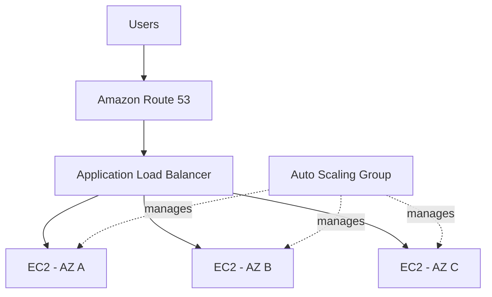

# 👕 MyClothes.com

> **Architecture Design Project**
>
> A stateful e-commerce application redesigned into a horizontally scalable stateless web architecture using external session storage, caching, and a highly available relational database.

---

# 1. Project Overview

MyClothes.com은 사용자가 상품을 확인하고 Shopping Cart에 상품을 추가할 수 있는 Online Clothing Store이다.

WhatIsTheTime.com과 달리 사용자의 상태를 관리해야 한다.

예를 들어:

```text
User A
├── Shopping Cart
├── Session
├── Name
└── Address
```

Application을 하나의 EC2 Instance에서 실행한다면 이러한 상태를 해당 Instance에서 관리할 수도 있다.

하지만 Web Tier를 Horizontal Scaling하면 문제가 발생한다.

```text
Request 1 → EC2 A
Request 2 → EC2 B
Request 3 → EC2 C
```

각 Request가 서로 다른 EC2 Instance로 전달될 수 있기 때문이다.

이 프로젝트의 핵심 목표는:

> **Application State를 개별 EC2 Instance에서 분리하여 Web Tier를 Stateless하게 만드는 것**

이다.

---

# 2. Requirements

## Application Requirements

- 사용자는 Shopping Cart를 사용할 수 있어야 한다.
- 사용자의 Session이 유지되어야 한다.
- Name, Address 등의 User Data를 저장해야 한다.
- 여러 사용자의 Request를 동시에 처리할 수 있어야 한다.

## Scalability Requirements

- EC2 Instance를 Horizontal Scaling할 수 있어야 한다.
- 특정 EC2 Instance에 사용자가 종속되어서는 안 된다.
- Database Read Traffic 증가에 대응할 수 있어야 한다.

## Availability Requirements

- EC2 Instance 장애가 전체 서비스 장애로 이어져서는 안 된다.
- Availability Zone 장애에 대응할 수 있어야 한다.
- Database와 Session Store 역시 고가용성을 고려해야 한다.

## Security Requirements

- Backend EC2를 Internet에 직접 노출하지 않는다.
- Database와 Cache는 Web Tier를 통해서만 접근할 수 있도록 제한한다.

---

# 3. Initial Architecture

WhatIsTheTime.com에서 만든 기본적인 Web Architecture를 시작점으로 사용한다.



Compute Scaling 자체는 이미 가능하다.

하지만 MyClothes.com에는 새로운 문제가 존재한다.

```text
State
```

---

# 4. Problem: Local Session State

사용자 A가 EC2 A에 접속하여 Shopping Cart에 상품을 추가했다고 가정한다.

```text
User A
  ↓
EC2 A
  ↓
Cart = [Shirt, Pants]
```

Shopping Cart를 EC2 A의 Local State에 저장한다.

다음 Request가 EC2 B로 전달된다면:

```text
User A
  ↓
ALB
  ↓
EC2 B

Cart = ?
```

EC2 B에는 EC2 A에 저장된 Session Data가 없다.

따라서 Shopping Cart가 사라진 것처럼 보일 수 있다.

---

# 5. Architecture Goal

Horizontal Scaling을 제대로 활용하려면 EC2 Instance를 가능한 한 **Disposable Compute**로 만들어야 한다.

즉:

```text
EC2 A가 죽어도
User State가 사라지지 않아야 한다.

EC2 B로 Request가 가도
동일한 State를 사용할 수 있어야 한다.

EC2 C가 새로 생성되어도
기존 User를 처리할 수 있어야 한다.
```

목표 Architecture는 다음과 같다.

```text
Stateful Application
        ↓
Externalize State
        ↓
Stateless Web Tier
```

---

# 6. Option 1: ELB Stickiness

첫 번째 방법은 Load Balancer의 Stickiness를 사용하는 것이다.

Stickiness 또는 Session Affinity를 사용하면 동일한 Client의 Request를 동일한 Backend Instance로 전달할 수 있다.

```text
User A
  ↓
 ALB
  ↓
EC2 A

Request 1 → EC2 A
Request 2 → EC2 A
Request 3 → EC2 A
```

## Benefit

기존 Application 구조를 크게 변경하지 않고 Session을 유지할 수 있다.

## Problem

State 자체는 여전히 EC2 A에 존재한다.

```text
User A
 ↓
EC2 A
 ↓
Session
```

EC2 A가 종료되면:

```text
EC2 A ❌
   ↓
Session ❌
```

따라서 Stickiness는 Request Routing 문제를 완화하지만 **State를 Compute에서 분리하지는 않는다.**

### Design Assessment

```text
Stickiness
→ Same Client → Same EC2

하지만

State
→ 여전히 EC2에 종속
```

---

# 7. Option 2: Store State in Client Cookies

두 번째 방법은 Shopping Cart 자체를 Client Cookie에 저장하는 것이다.

```text
Browser Cookie

Cart:
- Shirt
- Pants
```

Client는 Request를 보낼 때 Cookie를 함께 전송한다.

```text
User
 │
 │ Cookie: Cart Data
 ▼
ALB
 │
 ├── EC2 A
 ├── EC2 B
 └── EC2 C
```

어떤 EC2가 Request를 처리하더라도 Client가 State를 전달하기 때문에 동일한 정보를 확인할 수 있다.

## Benefit

Web Tier가 Stateless해진다.

```text
State
EC2 ❌
Client Cookie ✅
```

## Problems

Cookie에 많은 정보를 저장하면 Request 크기가 증가한다.

```text
Every Request
+
Shopping Cart Data
+
Cookie
```

또한 Cookie는 Client 측에 있기 때문에 사용자가 내용을 변경할 가능성도 고려해야 한다.

따라서 Application은 Client에서 전달된 값을 신뢰하지 않고 적절하게 검증해야 한다.

강의에서 다룬 Cookie 크기 기준은 4 KB 미만이다.

### Design Assessment

```text
장점
→ Stateless Web Tier

단점
→ Request Size 증가
→ Client-side Data
→ Tampering Risk
→ Limited Cookie Size
```

---

# 8. Selected Design: Session ID + ElastiCache

더 나은 방법은 Client에 전체 Session Data를
