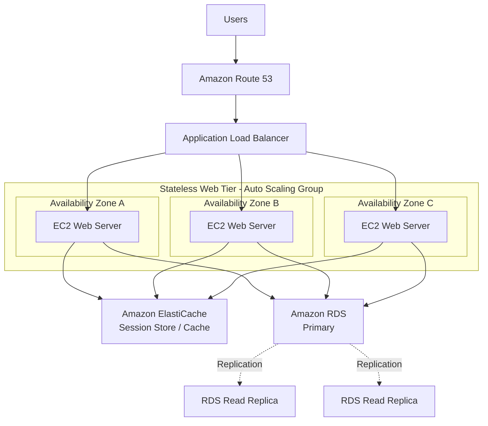
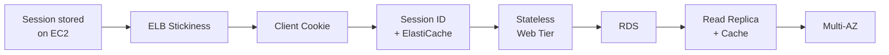
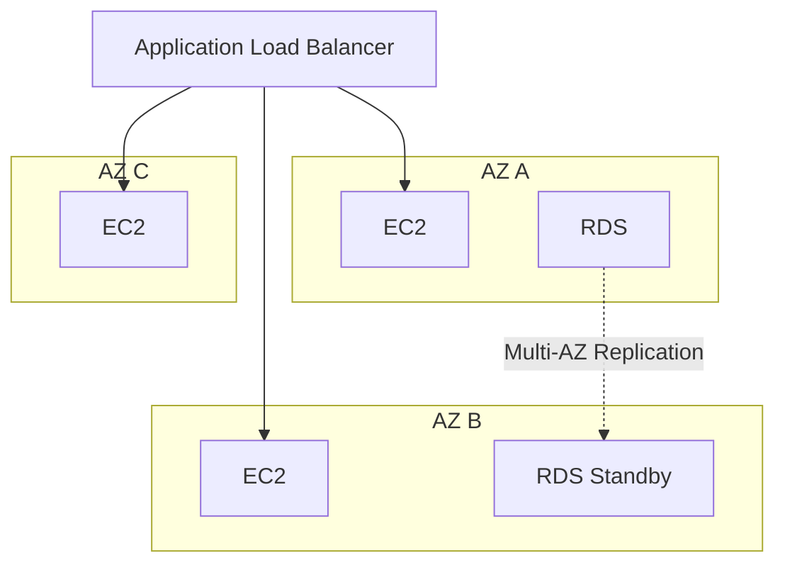
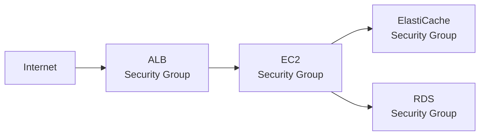

# MyClothes.com - Architecture

## Final Architecture



---

## Architecture Evolution



---

## State Management

초기 문제는 Shopping Cart와 같은 Session State가 특정 EC2 Instance에 저장되어 있다는 것이다.

```text
User
 ↓
EC2 A
 ↓
Shopping Cart
```

다음 Request가 다른 Instance로 전달되면:

```text
Request 1
User → EC2 A → Cart 있음

Request 2
User → EC2 B → Cart 없음
```

따라서 EC2 내부에서 Session State를 분리한다.

```text
User
 ↓
Cookie: session_id
 ↓
Any EC2 Instance
 ↓
ElastiCache
 ↓
Session / Shopping Cart
```

결과적으로 Web Tier는 Stateless하게 동작할 수 있다.

```text
EC2 A ─┐
EC2 B ─┼──→ ElastiCache
EC2 C ─┘
```

어떤 EC2가 Request를 처리하더라도 동일한 Session Store에 접근할 수 있다.

---

## Why Not Store the Entire Cart in a Cookie?

Shopping Cart 전체를 Client Cookie에 저장하는 방법도 가능하다.

```text
Client
 ↓
Cookie
├── Product A
├── Product B
└── Product C
```

이 방식에서는 Web Server가 Stateless해질 수 있지만 다음 문제가 발생한다.

```text
Large Cookie
→ HTTP Request 증가

Client-side Data
→ 변조 가능성

Cookie Size
→ 제한적
```

따라서 실제 Session Data는 Server-side Store에 두고 Client에는 Session ID만 저장하는 구조를 사용할 수 있다.

```text
Client Cookie
└── session_id=12345

        ↓

ElastiCache
└── 12345 → Shopping Cart Data
```

---

## Persistent Data

Session과 달리 사용자 이름, 주소 등의 영구적인 데이터는 Relational Database에 저장한다.

```text
Temporary / Session State
→ ElastiCache

Persistent Relational Data
→ Amazon RDS
```

따라서 데이터의 성격에 따라 Storage 역할을 분리한다.

---

## Database Read Scaling

Read Traffic이 증가하면 RDS Read Replica를 사용할 수 있다.

```text
                    ┌── Read Replica
Application → RDS Primary
                    └── Read Replica
```

역할은 다음과 같다.

```text
Write
→ RDS Primary

Read
→ Read Replica
```

이를 통해 Read Workload를 여러 Database Instance로 분산할 수 있다.

---

## Database Caching

반복적으로 조회되는 데이터는 ElastiCache를 이용해 Cache할 수 있다.

```text
Application
     ↓
ElastiCache
     │
     ├── Cache Hit
     │      ↓
     │   Return Data
     │
     └── Cache Miss
            ↓
           RDS
            ↓
       Store in Cache
            ↓
       Return Data
```

### Lazy Loading

```text
Request
 ↓
Check Cache
 ↓
Hit? ── Yes ──→ Return
 ↓ No
Query RDS
 ↓
Store Result in Cache
 ↓
Return
```

Cache를 사용하면 동일한 데이터를 반복적으로 RDS에서 읽는 작업을 줄일 수 있다.

단, Cache Data와 Database Data가 달라지는 **Stale Data** 문제를 고려해야 한다.

---

## Read Replica vs ElastiCache

```text
RDS Read Replica
→ Database의 Read Capacity 증가

ElastiCache
→ Database까지 도달하는 Read 자체를 감소
```

둘은 경쟁 관계가 아니라 서로 다른 문제를 해결한다.

---

## High Availability

Web Tier뿐 아니라 Data Tier도 Availability를 고려한다.



### 역할 구분

```text
RDS Read Replica
→ Read Scaling

RDS Multi-AZ
→ High Availability / Failover
```

Read Replica와 Multi-AZ는 목적이 다르다.

ElastiCache 역시 지원되는 구성에서는 Multi-AZ를 통해 Availability를 높일 수 있다.

---

## Security Boundary

각 Tier는 필요한 이전 Tier에서만 Traffic을 허용한다.



Security Group 관계:

```text
Internet
   ↓ HTTP / HTTPS
ALB SG
   ↓ Application Traffic
EC2 SG
   ├──→ ElastiCache SG
   └──→ RDS SG
```

RDS와 ElastiCache를 Internet에 직접 공개할 필요가 없다.

```text
Internet ──X──→ RDS
Internet ──X──→ ElastiCache
```

---

## Three-Tier Architecture

최종적으로 MyClothes.com은 다음과 같은 3-Tier 구조로 볼 수 있다.

```text
┌─────────────────────────────┐
│        Client Tier          │
│           User              │
└──────────────┬──────────────┘
               ↓
┌─────────────────────────────┐
│    Web / Application Tier   │
│                             │
│      ALB → ASG → EC2        │
└──────────────┬──────────────┘
               ↓
┌─────────────────────────────┐
│          Data Tier          │
│                             │
│   ElastiCache     RDS       │
│   Session/Cache   Data      │
└─────────────────────────────┘
```

---

## Architecture Principles

```text
Session State
      ↓
Externalize from EC2
      ↓
ElastiCache
      ↓
Stateless Web Tier
      ↓
EC2 becomes replaceable
      ↓
Horizontal Scaling becomes easier
```

그리고 Data Layer에서는:

```text
Persistent Data
→ RDS

Read Capacity 부족
→ Read Replicas

Repeated Reads
→ ElastiCache

Database Availability
→ RDS Multi-AZ
```

---

## Final Design Summary

```text
Users
  ↓
Route 53
  ↓
Application Load Balancer
  ↓
Auto Scaling Group
  ↓
Stateless EC2 Web Servers
  │
  ├── Session ID → ElastiCache
  │
  └── Persistent Data → RDS
                         │
                         ├── Read Replicas
                         └── Multi-AZ
```

### 핵심 설계 목표

> **Application State를 EC2에서 분리하여 Compute Instance를 언제든 추가, 제거, 교체할 수 있는 Stateless Web Tier를 구성한다.**

이를 통해 MyClothes.com은 Horizontal Scaling과 High Availability에 적합한 Architecture로 발전한다.
