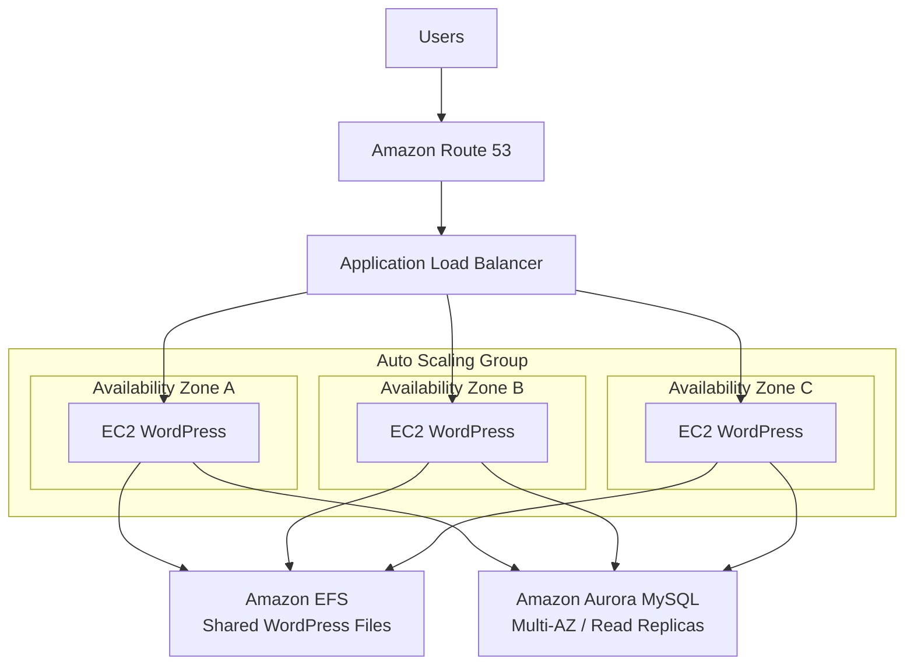

# 📝 MyWordPress.com

> **Architecture Design Project**
>
> A scalable WordPress architecture using shared file storage and a highly available relational database.

---

# 1. Project Overview

MyWordPress.com은 AWS에서 운영되는 WordPress 기반 Web Application이다.

서비스가 성장하면서 여러 EC2 Instance로 Horizontal Scaling할 수 있어야 하며, 사용자가 업로드한 이미지와 WordPress의 데이터를 모든 Instance에서 일관되게 사용할 수 있어야 한다.

주요 요구사항은 다음과 같다.

```text
Scalable WordPress
        +
Correctly Shared Uploaded Files
        +
Persistent MySQL Data
        +
High Availability
```

이번 Architecture의 핵심은 **Compute, Shared Files, Database를 서로 분리하는 것**이다.

---

# 2. Requirements

## Application Requirements

- WordPress Application 운영
- Horizontal Scaling 가능
- 여러 EC2 Instance 사용
- 사용자가 업로드한 이미지 공유
- User / Blog Data를 MySQL에 저장
- Multi-AZ Architecture 구성

---

# 3. Data Classification

WordPress가 사용하는 데이터를 먼저 두 종류로 나눈다.

```text
WordPress Data
│
├── Structured Data
│   ├── Users
│   ├── Posts
│   ├── Comments
│   └── Application Data
│
└── Files
    ├── Images
    └── Uploaded Content
```

이 두 종류의 데이터는 서로 다른 Storage Requirement를 가진다.

```text
Structured Relational Data
→ MySQL

Shared Files
→ Shared File System
```

따라서 하나의 Storage Service로 모든 문제를 해결하려 하지 않고 역할을 분리한다.

---

# 4. Initial Architecture

초기에는 하나의 EC2 Instance와 EBS Volume으로 WordPress를 운영할 수 있다.

```text
User
 ↓
Load Balancer
 ↓
EC2
 ↓
EBS
```

사용자가 이미지를 업로드하면 해당 EC2에 연결된 EBS Volume에 File이 저장된다.

```text
EC2 A
 ↓
EBS A
 ↓
cat.jpg
```

EC2 Instance가 하나뿐이라면 문제가 없다.

---

# 5. Problem: Horizontal Scaling

Traffic이 증가하여 EC2 Instance를 여러 개 사용한다고 가정한다.

```text
             Load Balancer
              /          \
             /            \
          EC2 A           EC2 B
            ↓               ↓
          EBS A           EBS B
```

각 EC2는 서로 다른 EBS Volume을 사용한다.

사용자가 EC2 A를 통해 이미지를 업로드하면:

```text
EC2 A
 ↓
EBS A
 ↓
cat.jpg
```

하지만 다음 Request가 Load Balancer에 의해 EC2 B로 전달될 수 있다.

```text
User
 ↓
Load Balancer
 ↓
EC2 B
 ↓
EBS B

cat.jpg ❌
```

EC2 B의 EBS에는 해당 File이 존재하지 않는다.

---

# 6. Root Cause

문제의 원인은 Load Balancer가 아니다.

또한 Auto Scaling 자체의 문제도 아니다.

핵심 문제는:

> **각 EC2 Instance가 서로 독립된 File Storage를 사용하고 있다는 것**

이다.

```text
EC2 A → EBS A

EC2 B → EBS B

EC2 C → EBS C
```

Compute Tier는 Horizontal Scaling 되었지만 File Storage는 공유되지 않는다.

따라서 새로운 Requirement가 생긴다.

```text
Multiple EC2 Instances
        ↓
Need Same Files
        ↓
Shared File System Required
```

---

# 7. Why EBS Is Not the Right Fit

Amazon EBS는 EC2에서 사용하는 Block Storage이다.

일반적인 EBS Volume은 특정 Availability Zone에 존재하며 EC2에 연결하여 사용한다.

```text
AZ-A

EC2
 ↓
EBS
```

따라서 여러 Availability Zone에 존재하는 많은 EC2 Instance가 동일한 WordPress File을 공유해야 하는 Requirement에는 적합하지 않다.

### EBS Multi-Attach?

일부 Provisioned IOPS EBS Volume에서는 Multi-Attach를 지원하지만, 이것이 이번 문제의 해결책은 아니다.

이번 Architecture의 요구사항은:

```text
Multiple EC2
+
Multiple AZ
+
Same File System
```

이다.

따라서 Multi-AZ에서 여러 EC2가 동시에 사용할 수 있는 Shared File System이 필요하다.

---

# 8. Solution: Amazon EFS

Amazon EFS는 여러 EC2 Instance가 동시에 Mount하여 사용할 수 있는 Managed File System이다.

Architecture를 다음과 같이 변경한다.

```text
             Load Balancer
                   ↓
          Auto Scaling Group
          /        |        \
       EC2 A     EC2 B     EC2 C
          \        |        /
           \       |       /
                  EFS
```

이제 모든 EC2 Instance가 동일한 File System을 사용한다.

사용자가 EC2 A를 통해 File을 업로드하면:

```text
EC2 A
 ↓
EFS
 ↓
cat.jpg
```

다음 Request가 EC2 B로 전달되어도:

```text
EC2 B
 ↓
EFS
 ↓
cat.jpg ✅
```

동일한 File을 사용할 수 있다.

---

# 9. EFS and Multi-AZ

EFS는 여러 Availability Zone의 EC2 Instance에서 접근할 수 있다.

```text
                  Amazon EFS
                  /        \
                 /          \
             AZ-A            AZ-B
              │               │
        Mount Target     Mount Target
              │               │
            EC2 A             EC2 B
```

여기서 Mount Target은 각 Availability Zone에서 EC2가 EFS에 Network로 접근할 수 있도록 제공되는 Access Point 역할을 한다.

중요한 점은 AZ마다 별도의 EFS가 존재하는 것이 아니라는 것이다.

```text
AZ-A Mount Target ─┐
                   │
                   ├── Same EFS
                   │
AZ-B Mount Target ─┘
```

즉 여러 AZ의 EC2가 **하나의 Shared File System**을 사용한다.

---

# 10. EBS vs EFS

| 특성 | Amazon EBS | Amazon EFS |
|---|---|---|
| Storage Type | Block Storage | Network File System |
| 기본 사용 형태 | EC2에 Volume 연결 | 여러 EC2에서 Mount |
| AZ | AZ 단위 | Multi-AZ 접근 가능 |
| Shared Files | 일반적인 목적 아님 | 적합 |
| WordPress Shared Uploads | 부적합 | 적합 |

이번 Architecture에서 중요한 선택 기준은 단순하다.

```text
Single EC2 Block Storage
→ EBS

Multiple EC2 Shared File System
→ EFS
```

---

# 11. Database Layer

WordPress의 User Data와 Blog Content는 MySQL Database에 저장한다.

초기에는 Amazon RDS for MySQL을 사용할 수 있다.

```text
EC2 Web Tier
      ↓
Amazon RDS
      ↓
MySQL Data
```

Application 규모가 증가하고 더 높은 Availability와 Read Scaling이 필요하다면 Aurora MySQL을 사용할 수 있다.

```text
WordPress
    ↓
Aurora MySQL
```

---

# 12. Aurora Architecture

Aurora를 사용하면 Writer와 Reader를 분리하여 Database Architecture를 구성할 수 있다.

```text
                Aurora Cluster
                     │
          ┌──────────┴──────────┐
          │                     │
       Writer                 Readers
          │                  /       \
        Write             Read       Read
```

### Writer

```text
INSERT
UPDATE
DELETE
→ Writer
```

### Reader

```text
SELECT
→ Aurora Reader
```

Reader를 사용하여 Read Workload를 분산할 수 있다.

---

# 13. Database High Availability

Database 역시 하나의 Availability Zone에만 의존하지 않도록 구성한다.

```text
AZ-A
└── Aurora Instance

AZ-B
└── Aurora Instance

AZ-C
└── Aurora Instance
```

이를 통해 Compute Tier뿐 아니라 Database Tier도 Multi-AZ Architecture로 구성할 수 있다.

---

# 14. Final Architecture



---

# 15. Storage Responsibilities

최종 Architecture에서는 Storage 역할이 명확하게 분리된다.

```text
EC2
→ Compute

EFS
→ Shared WordPress Files

Aurora
→ Persistent Relational Data
```

EC2 Instance 자체에는 중요한 Persistent State를 최대한 남기지 않는다.

따라서:

```text
EC2 A terminated
        ↓
New EC2 launched
        ↓
Mount same EFS
        +
Connect same Aurora
        ↓
Application continues
```

새로운 EC2 Instance도 동일한 File과 Database를 사용할 수 있다.

---

# 16. Auto Scaling Compatibility

Shared Storage를 사용하면 Auto Scaling과의 궁합도 좋아진다.

```text
Traffic ↑
   ↓
ASG Scale Out
   ↓
New EC2
   ↓
Mount EFS
   ↓
Connect Aurora
   ↓
Ready
```

새 Instance마다 별도의 Upload File을 복사할 필요가 없다.

Compute Instance를 교체 가능한 Resource로 만들 수 있다.

---

# 17. Failure Scenarios

## EC2 Failure

```text
EC2 A ❌
```

다른 EC2 Instance가 동일한 EFS와 Aurora를 사용하기 때문에 Application Data가 특정 EC2에 종속되지 않는다.

ASG는 필요한 경우 Replacement Instance를 생성할 수 있다.

---

## AZ Failure

```text
AZ-A ❌
```

다른 Availability Zone의 EC2 Instance가 계속 Application을 처리할 수 있다.

EFS와 Database Layer 역시 Multi-AZ를 고려하여 구성한다.

---

## New EC2 Instance

```text
New EC2
 ↓
Mount EFS
 ↓
Connect Aurora
 ↓
Same Files + Same Database
```

따라서 Horizontal Scaling 시 데이터 일관성을 유지할 수 있다.

---

# 18. Design Decisions

| Problem | Decision | Reason |
|---|---|---|
| Traffic 증가 | ASG | EC2 Horizontal Scaling |
| Traffic 분산 | ALB | 여러 EC2로 Request 분산 |
| EC2마다 Upload File이 다름 | EFS | Shared File System 제공 |
| Persistent WordPress Data | MySQL | Relational Data 저장 |
| Database 확장 | Aurora MySQL | Multi-AZ 및 Read Scaling |
| AZ Failure | Multi-AZ | Application Availability 향상 |
| EC2 교체 시 File 유지 | EFS | File을 Compute에서 분리 |

---

# 19. Architecture Evolution

전체 Architecture의 발전 과정을 정리하면 다음과 같다.

```text
Single EC2
    +
   EBS
    ↓
Horizontal Scaling
    ↓
Multiple EC2
    +
Separate EBS Volumes
    ↓
File Inconsistency
    ↓
Amazon EFS
    ↓
Shared File System
    ↓
Aurora MySQL
    ↓
Multi-AZ Scalable WordPress
```

---

# 20. Key Architecture Principle

이 프로젝트의 가장 중요한 설계 원칙은 **State를 Compute Instance에서 분리하는 것**이다.

```text
EC2
= Compute

EFS
= Shared Files

Aurora
= Relational Data
```

따라서 EC2는 가능한 한 교체 가능한 Resource가 된다.

```text
Instance 추가
Instance 제거
Instance 장애
Instance 교체

        ↓

Application Data 유지
```

---

# 21. Connection to Previous Projects

세 Architecture Project를 연결하면 다음과 같다.

```text
WhatIsTheTime.com
→ Compute Scaling
→ ELB + ASG + Multi-AZ

MyClothes.com
→ Session State 분리
→ ElastiCache + RDS

MyWordPress.com
→ Shared File State 분리
→ EFS + Aurora
```

점점 하나의 공통된 Architecture 원칙으로 모인다.

> **Compute Tier를 가볍고 교체 가능하게 만들고, 중요한 State는 목적에 맞는 외부 Data Service에 저장한다.**

---

# 22. 日本語 Architecture Summary

## 目的

MyWordPress.comでは、複数のEC2 InstanceでWordPressを水平スケーリングしながら、すべてのInstanceから同じUpload FileとDatabase Dataを利用できるArchitectureを設計します。

## Storage Problem

各EC2が個別のEBS Volumeを使用すると、あるInstanceにUploadされたFileを他のInstanceから利用できません。

```text
EC2 A → EBS A
EC2 B → EBS B
```

そのため、共有File SystemとしてAmazon EFSを利用します。

```text
EC2 A ─┐
EC2 B ─┼→ Amazon EFS
EC2 C ─┘
```

## Final Design

- ALBによるTraffic分散
- ASGによるHorizontal Scaling
- EFSによるShared File Storage
- Aurora MySQLによるRelational Data管理
- Multi-AZによるHigh Availability

重要なポイントは、Application StateをEC2から分離し、EC2を交換可能なCompute Resourceにすることです。

---

# 23. English Architecture Summary

## Objective

MyWordPress.com requires a horizontally scalable WordPress architecture where every EC2 instance can access the same uploaded files and relational application data.

## Storage Problem

Using a separate EBS volume for each EC2 instance causes file inconsistency when requests are distributed across multiple instances.

Amazon EFS solves this problem by providing a shared file system accessible from multiple EC2 instances across Availability Zones.

## Final Design

The architecture uses:

- Application Load Balancer for traffic distribution
- Auto Scaling Group for horizontal compute scaling
- Amazon EFS for shared WordPress files
- Amazon Aurora MySQL for relational data
- Multiple Availability Zones for high availability

The main design principle is to separate persistent state from the compute tier so that EC2 instances can be added, removed, or replaced without losing application data.

---

# 24. Architecture Vocabulary

| English | 日本語 | 한국어 |
|---|---|---|
| Shared File System | 共有ファイルシステム | 공유 파일 시스템 |
| Block Storage | ブロックストレージ | 블록 스토리지 |
| Network File System | ネットワークファイルシステム | 네트워크 파일 시스템 |
| Mount | マウント | 마운트 |
| Mount Target | マウントターゲット | 마운트 타깃 |
| File Inconsistency | ファイルの不整合 | 파일 불일치 |
| Persistent Data | 永続データ | 영구 데이터 |
| Horizontal Scaling | 水平スケーリング | 수평 확장 |
| Shared Storage | 共有ストレージ | 공유 스토리지 |
| Aurora Writer | Auroraライター | Aurora 쓰기 인스턴스 |
| Aurora Reader | Auroraリーダー | Aurora 읽기 인스턴스 |
| Replaceable Compute | 交換可能なコンピュート | 교체 가능한 컴퓨팅 |
