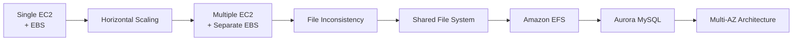
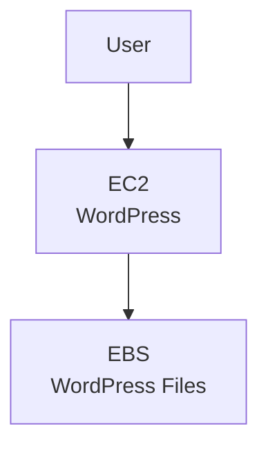
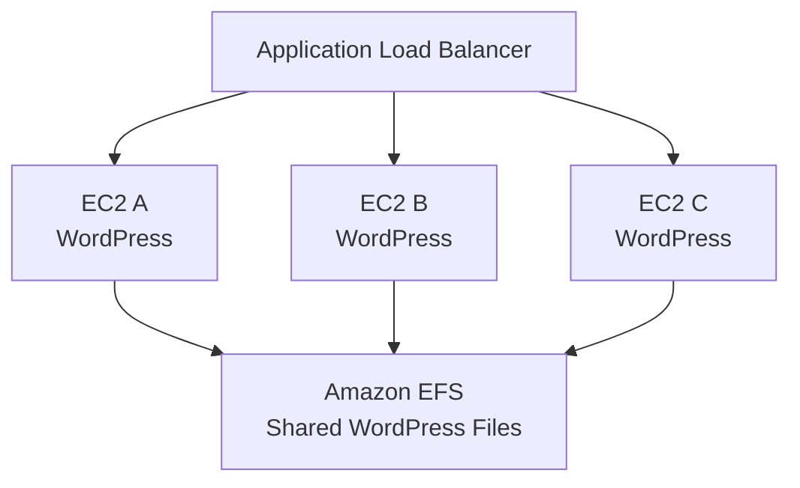
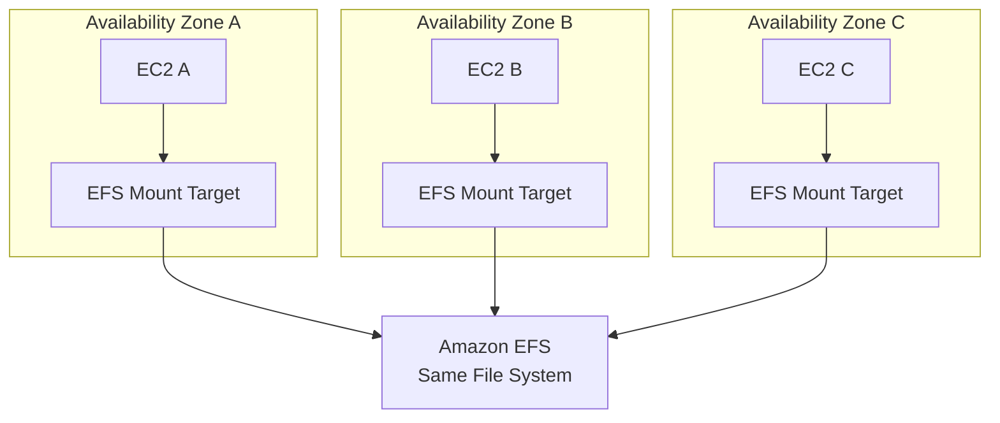
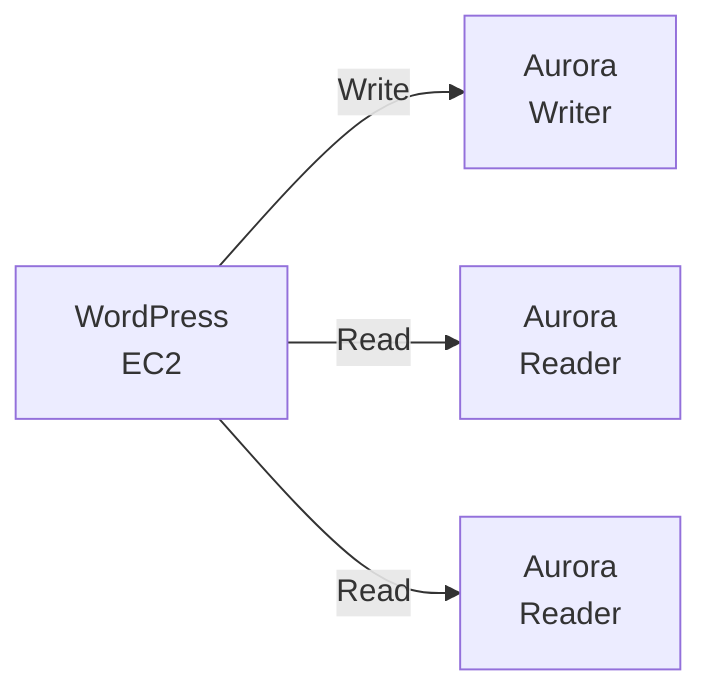
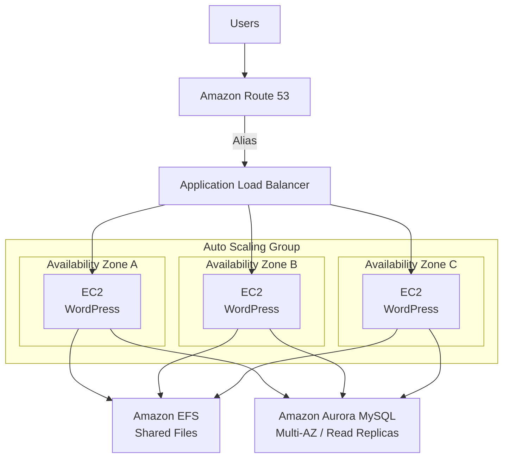
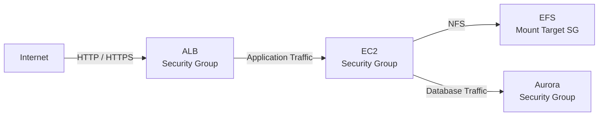

# MyWordPress.com - Architecture

## Architecture Evolution



---

## Initial Architecture

단일 EC2에서는 EBS에 WordPress Upload File을 저장해도 문제가 없다.



하지만 Horizontal Scaling을 시작하면 문제가 발생한다.

```text
EC2 A → EBS A → cat.jpg

EC2 B → EBS B → cat.jpg 없음
```

Load Balancer가 다음 Request를 EC2 B로 보내면 사용자가 업로드한 File을 찾지 못할 수 있다.

---

## Storage Solution

여러 EC2가 동일한 File System을 사용하도록 Amazon EFS를 사용한다.



이제 어떤 EC2에서 Request를 처리하더라도 동일한 Upload File에 접근할 수 있다.

```text
Upload

User
 ↓
EC2 A
 ↓
EFS
 ↓
cat.jpg


Next Request

User
 ↓
EC2 B
 ↓
EFS
 ↓
cat.jpg ✅
```

---

## EFS Multi-AZ Access

각 Availability Zone의 EC2는 Mount Target을 통해 동일한 EFS에 접근한다.



핵심은 AZ마다 별도의 EFS를 사용하는 것이 아니라는 것이다.

```text
Mount Target A ─┐
Mount Target B ─┼──→ Same Amazon EFS
Mount Target C ─┘
```

---

## Database Layer

WordPress의 구조화된 데이터는 Aurora MySQL에 저장한다.

```text
Shared Files
→ Amazon EFS

Users / Posts / Comments / Application Data
→ Aurora MySQL
```

Read Scaling이 필요하면 Aurora Reader를 사용할 수 있다.



---

## Final Architecture



---

## Data Flow

### Web Request

```text
User
 ↓
Route 53
 ↓
Application Load Balancer
 ↓
EC2 WordPress
```

### Uploaded File

```text
EC2
 ↓
Amazon EFS
 ↓
Shared WordPress Files
```

### Relational Data

```text
EC2
 ↓
Aurora MySQL
 ↓
Users / Posts / Comments
```

---

## Storage Responsibilities

```text
┌─────────────────────────────┐
│            EC2              │
│          Compute            │
└──────────────┬──────────────┘
               │
        ┌──────┴──────┐
        ↓             ↓
┌─────────────┐ ┌─────────────┐
│     EFS     │ │   Aurora    │
│Shared Files │ │Relational DB│
└─────────────┘ └─────────────┘
```

즉 중요한 State를 EC2에서 분리한다.

```text
EC2
= Replaceable Compute

EFS
= Persistent Shared Files

Aurora
= Persistent Relational Data
```

---

## Scaling Flow

```text
Traffic Increase
      ↓
Auto Scaling Group
      ↓
Launch New EC2
      ↓
Mount Same EFS
      ↓
Connect Same Aurora
      ↓
Ready to Serve Traffic
```

새 EC2를 생성할 때 기존 Upload File을 별도로 복사할 필요가 없다.

---

## Failure Handling

### EC2 Failure

```text
EC2 A ❌
   ↓
Other EC2 Instances continue
   ↓
Same EFS
+
Same Aurora
```

Application State가 EC2에 종속되지 않기 때문에 다른 Instance가 계속 서비스를 제공할 수 있다.

### New EC2 Replacement

```text
ASG
 ↓
New EC2
 ↓
Mount EFS
+
Connect Aurora
 ↓
Application Ready
```

### Availability Zone Failure

```text
AZ-A ❌

AZ-B EC2 ✅
AZ-C EC2 ✅
      ↓
Shared EFS
+
Aurora
```

Compute와 Data Layer를 Multi-AZ Architecture로 구성하여 하나의 AZ 장애가 전체 서비스 장애로 이어지지 않도록 설계한다.

---

## Security Boundary



Network Access는 필요한 Tier 사이에서만 허용한다.

```text
Internet
   ↓
ALB SG
   ↓
EC2 SG
   ├──→ EFS SG
   └──→ Aurora SG
```

EFS와 Database를 Internet에 직접 공개할 필요가 없다.

---

## Architecture Decision

```text
Problem:
Multiple EC2 instances need the same WordPress files.

                    ↓

Requirement:
Shared File System across Availability Zones.

                    ↓

Decision:
Amazon EFS

                    ↓

Result:
Every EC2 instance can access the same files.
```

Database는 별도로 분리한다.

```text
Shared Files
→ EFS

Relational Application Data
→ Aurora MySQL
```

---

## Final Architecture Principle

```text
             Application State
                    │
          ┌─────────┴─────────┐
          ↓                   ↓
     Shared Files        Relational Data
          ↓                   ↓
         EFS                Aurora

                    ↑
                    │
          Replaceable Compute
                    │
             EC2 / Auto Scaling
```

### Core Principle

> **Compute와 Persistent State를 분리한다.**

그 결과 EC2 Instance는:

```text
Launch
Replace
Scale Out
Scale In
Terminate
```

되어도 중요한 Application Data가 특정 Instance에 종속되지 않는다.
