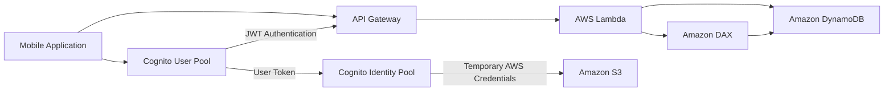
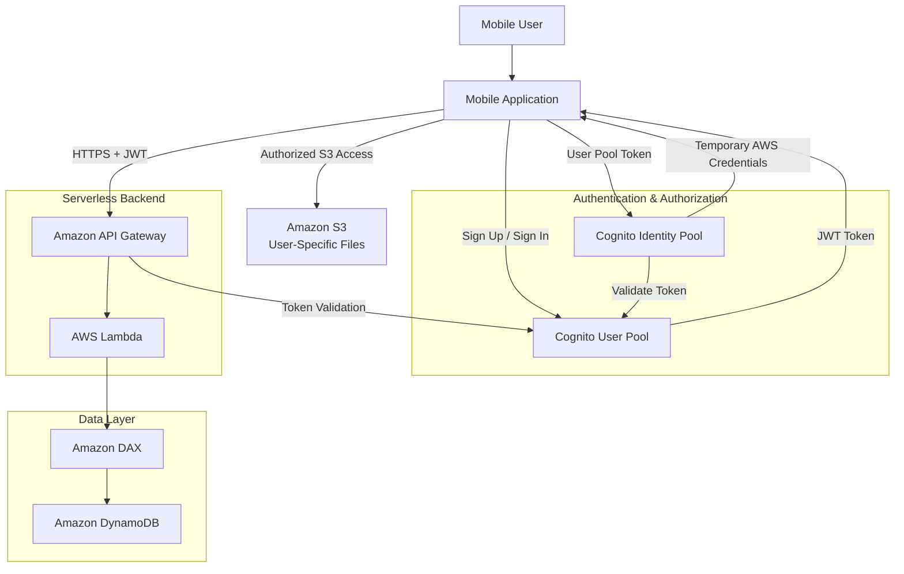
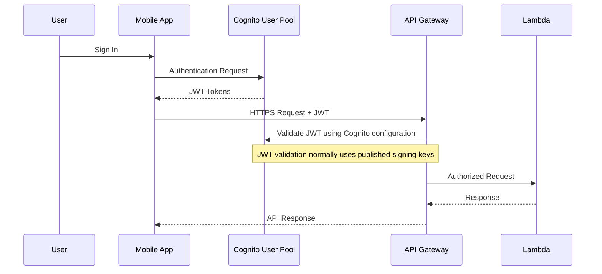
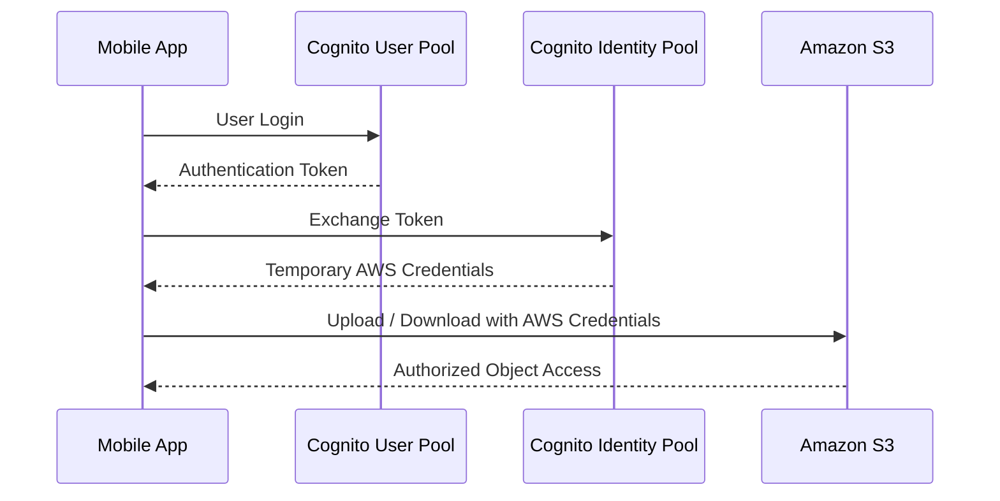
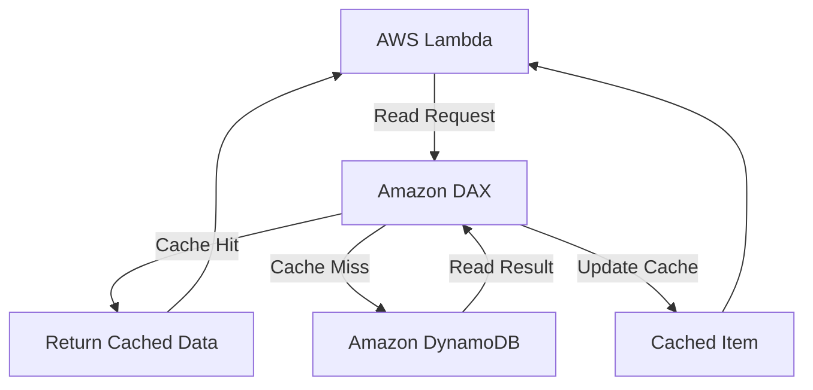
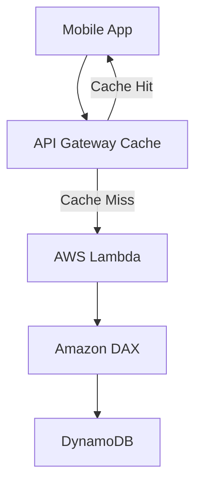
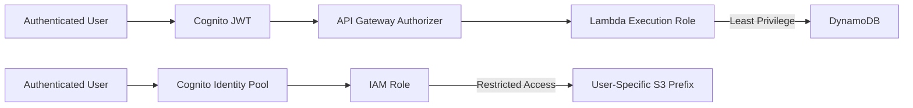

# MyTodoList - Architecture

## Architecture Evolution



---

## Final Architecture



---

## REST API Request Flow

```text
Mobile Application
        |
        | HTTPS Request + JWT
        v
Amazon API Gateway
        |
        | Validate Token
        v
AWS Lambda
        |
        | Read / Write Todo Data
        v
Amazon DAX
        |
        | Cache Miss / Write
        v
Amazon DynamoDB
        |
        v
API Response
        |
        v
Mobile Application
```

DAX를 사용하는 경우 애플리케이션은 DAX Client를 통해 DynamoDB 데이터에 접근한다.

DAX는 DynamoDB 읽기 성능 최적화를 위한 선택적 계층이다.

---

## Authentication Flow



Cognito User Pool은 사용자를 인증한다.

API Gateway의 Cognito Authorizer는 발급된 JWT의 유효성을 검증한다.

실제 JWT 검증은 매 요청마다 Cognito 서비스에 네트워크 요청을 보내는 방식이 아니라 공개 서명 키를 이용해 수행할 수 있다.

---

## Direct S3 Access Flow



### User-Specific S3 Prefix

```text
S3 Bucket
└── users/
    ├── identity-A/
    │   ├── profile.jpg
    │   └── document.pdf
    │
    ├── identity-B/
    │   └── image.png
    │
    └── identity-C/
        └── attachment.zip
```

IAM 정책을 통해 사용자별 Prefix 접근을 제한한다.

---

## DynamoDB Caching



### Cache Hit

```text
Lambda
  ↓
DAX
  ↓
Cached Data
  ↓
Lambda
```

### Cache Miss

```text
Lambda
  ↓
DAX
  ↓
DynamoDB
  ↓
DAX
  ↓
Lambda
```

---

## Optional API Gateway Caching



API Gateway Cache와 DAX는 서로 다른 계층에서 작동한다.

```text
API Gateway Cache Hit
→ Lambda Invocation 생략 가능

DAX Cache Hit
→ DynamoDB Read 감소
```

사용자별 비공개 API 응답을 캐싱하는 경우 Cache Key와 인증 경계를 신중히 설계해야 한다.

---

## Security Boundary



---

## Failure Handling

```text
Invalid JWT
→ API Gateway rejects request

Unauthorized S3 Prefix
→ IAM denies access

Lambda Error
→ API request fails
→ Logs and metrics used for investigation

DAX Unavailable
→ Requires application-level fallback strategy
→ Direct DynamoDB access can be designed if appropriate
```

---

## Architecture Principles

```text
Serverless Compute
        +
Managed Authentication
        +
Fine-Grained Authorization
        +
NoSQL Database
        +
Optional Read Cache
        =
Scalable Mobile Backend
```

## Design Status

Architecture Design Only.

No production deployment or performance benchmark has been completed.