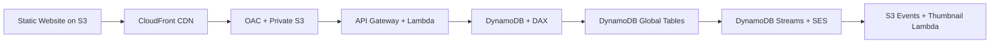
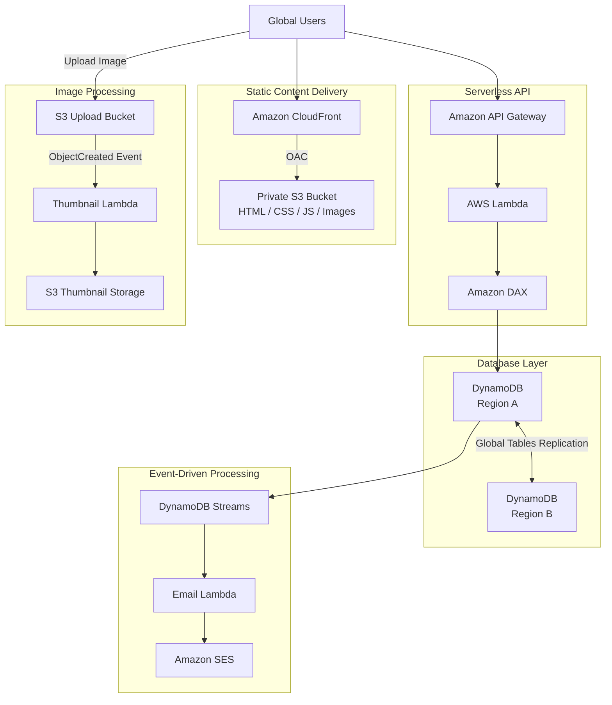
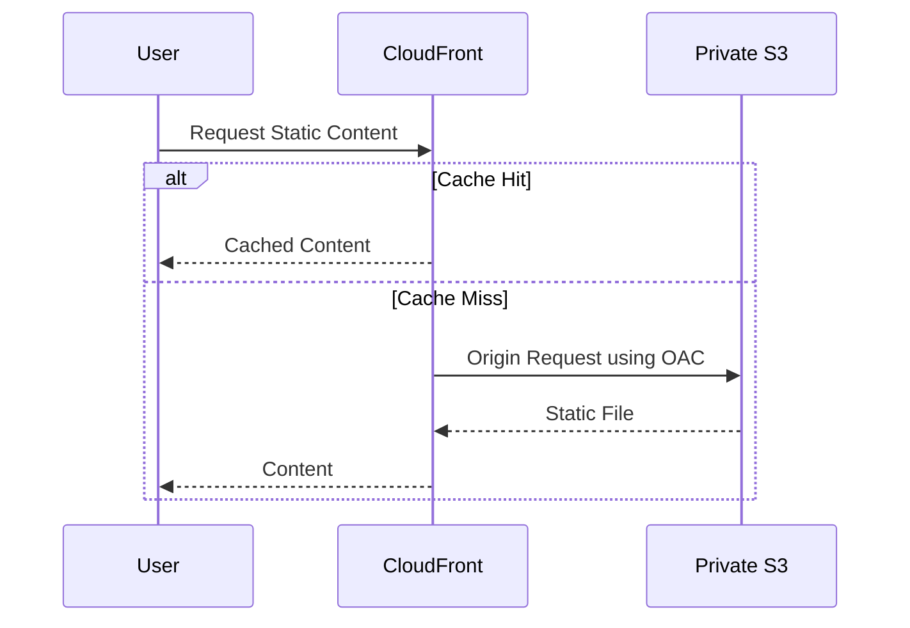
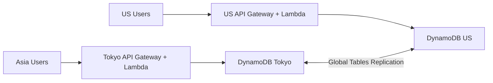
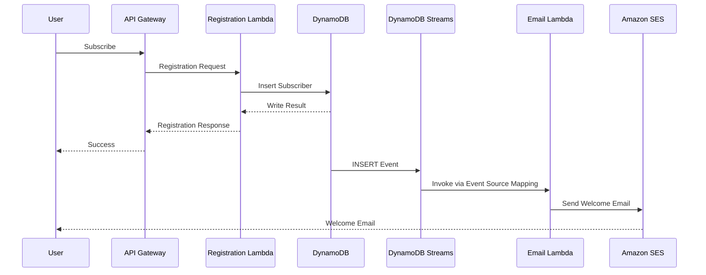
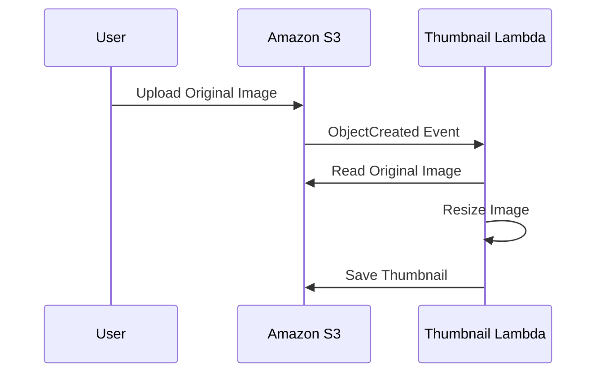
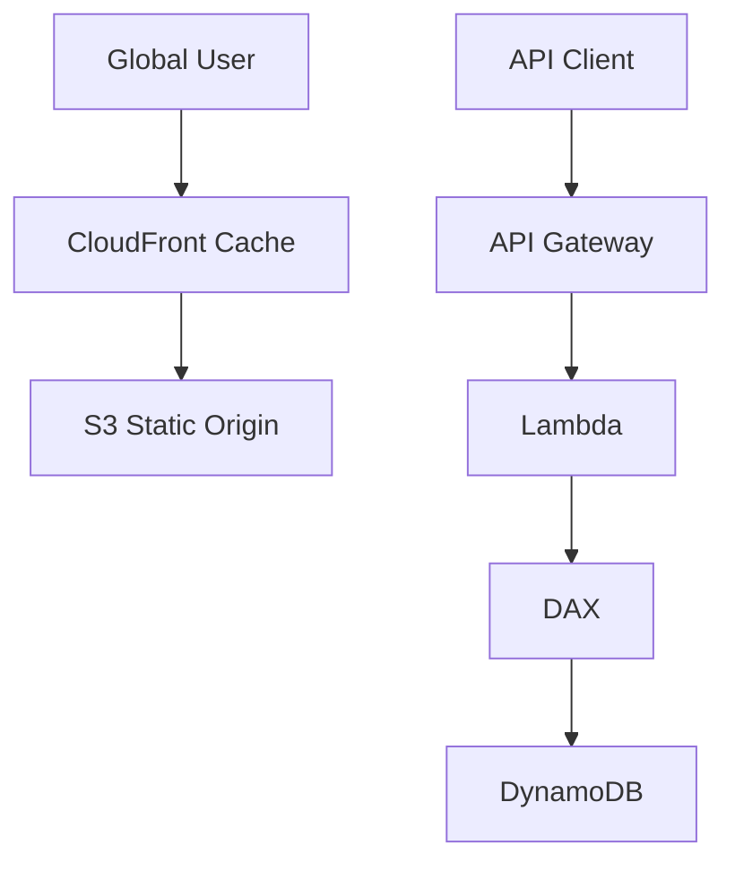

# MyBlog.com - Architecture

## Architecture Evolution



---

## Final Architecture



이 다이어그램은 여러 아키텍처 기능을 한눈에 보여주는 개념 설계다.

실제 Multi-Region 환경에서는 Region별 API, Lambda, DAX 구성과 사용자 라우팅을 별도로 설계해야 한다.

---

## Static Website Delivery



### Architecture

```text
Global User
     |
     v
CloudFront Edge Location
     |
     | Cache Miss
     v
Private S3 Origin
```

OAC와 S3 Bucket Policy를 통해 CloudFront Distribution만 Origin에 접근하도록 구성할 수 있다.

---

## Dynamic REST API

```text
Browser
   |
   | HTTPS Request
   v
API Gateway
   |
   v
Lambda
   |
   v
DAX
   |
   v
DynamoDB
```

### Responsibilities

```text
API Gateway
→ API Entry Point

Lambda
→ Business Logic

DAX
→ DynamoDB Read Cache

DynamoDB
→ Persistent NoSQL Data
```

---

## Multi-Region Database



DynamoDB Global Tables는 Multi-Region Active-Active 데이터베이스 구성을 지원한다.

글로벌 지연 시간 개선을 위해서는 데이터베이스뿐 아니라 API 처리 경로도 Region별로 설계해야 한다.

복제 지연 및 동시 쓰기 충돌을 고려한다.

---

## Welcome Email Workflow



### Event Flow

```text
New Subscriber
      ↓
DynamoDB INSERT
      ↓
DynamoDB Streams
      ↓
Lambda
      ↓
Amazon SES
      ↓
Welcome Email
```

### Design Considerations

- 신규 구독자 이벤트 필터링
- 중복 이벤트 처리
- Lambda 재시도
- SES 발신자 검증
- IAM 최소 권한

---

## Automatic Thumbnail Generation



### S3 Prefix Design

```text
S3 Bucket
├── originals/
│   ├── photo-001.jpg
│   └── photo-002.jpg
│
└── thumbnails/
    ├── photo-001-small.jpg
    └── photo-002-small.jpg
```

S3 Event Notification을 `originals/` Prefix에만 적용해 재귀 호출을 방지한다.

---

## Cache Layers



| Cache | Purpose |
|---|---|
| CloudFront | Static Content Delivery |
| API Gateway Cache | Optional API Response Caching |
| DAX | DynamoDB Read Caching |

---

## Failure Handling

```text
S3 Origin Request Failure
→ CloudFront returns an error or eligible cached response

Lambda Failure
→ API error response
→ CloudWatch investigation

Email Lambda Failure
→ Retry and failure-handling configuration required

Thumbnail Lambda Failure
→ Original file remains
→ Thumbnail generation requires retry or recovery

Regional Database Failure
→ Multi-Region failover design required
```

---

## Architecture Principles

```text
Global CDN
    +
Serverless API
    +
Managed NoSQL Database
    +
Event-Driven Processing
    +
Optional Multi-Region Replication
    =
Scalable Global Website
```

## Design Status

Architecture Design Only.

No production deployment or multi-region failover test has been completed.